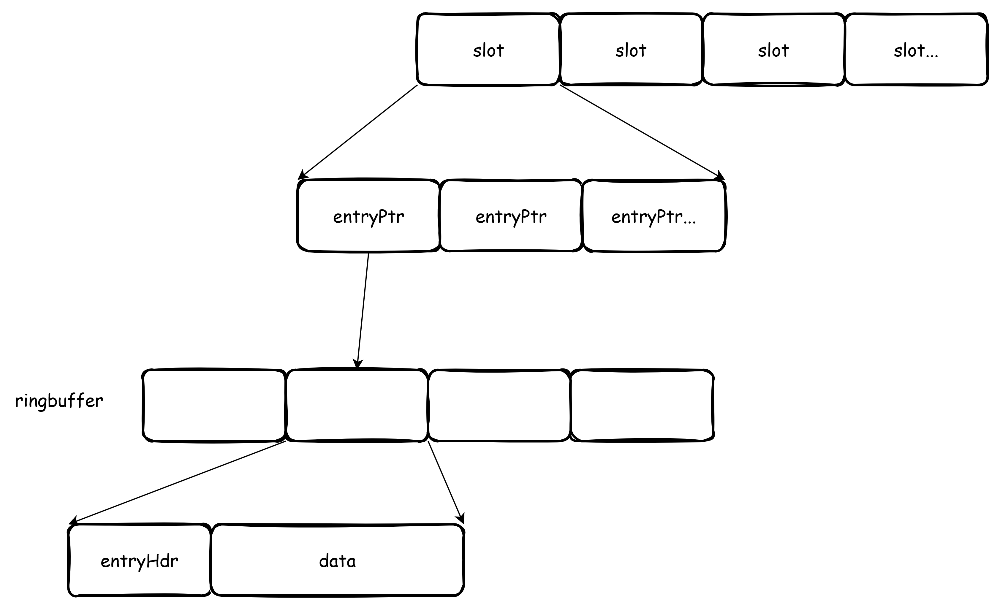

# FreeCache

/// caption
///

FreeCache 是一个用于 Go 的缓存库，具有零 GC 开销和高并发性能。

<!-- more -->

号称具有以下特性：

- 存储数亿个条目
- 零 GC 开销
- 高并发线程安全访问
- Pure Go 实现
- 支持缓存条目过期
- 接近 LRU 算法的缓存淘汰策略
- 严格限制内存使用
- 附带一个玩具服务器，它支持一些带有 pipeline 的基本 Redis 命令
- 迭代器支持

基本使用：
```go
// In bytes, where 1024 * 1024 represents a single Megabyte, and 100 * 1024*1024 represents 100 Megabytes.
cacheSize := 100 * 1024 * 1024
cache := freecache.NewCache(cacheSize)
debug.SetGCPercent(20)
key := []byte("abc")
val := []byte("def")
expire := 60 // expire in 60 seconds
cache.Set(key, val, expire)
got, err := cache.Get(key)
if err != nil {
    fmt.Println(err)
} else {
    fmt.Printf("%s\n", got)
}
affected := cache.Del(key)
fmt.Println("deleted key ", affected)
fmt.Println("entry count ", cache.EntryCount())
```

## 核心类

### Cache
`Cache` 是 FreeCache 的使用入口，由多个 segment 分片组成，每个 segment 分片一把锁，减轻锁争用压力。
```go
// Cache is a freecache instance.
type Cache struct {
	locks    [segmentCount]sync.Mutex
	segments [segmentCount]segment
}
```

### RingBuffer

RingBuffer 可以看做一个固定长度的缓冲区，当写入数据超过 RingBuffer 的长度时，会循环复用缓冲区开端的内存，可以看做一个环形的缓冲区。FreeCache 中的 RingBuffer 提供一种面向流式数据写入的接口，数据结构定义如下：

```go
// Ring buffer has a fixed size, when data exceeds the
// size, old data will be overwritten by new data.
// It only contains the data in the stream from begin to end
type RingBuf struct {
	begin int64 // beginning offset of the data stream.
	end   int64 // ending offset of the data stream.
	data  []byte
	index int //range from '0' to 'len(rb.data)-1'
}
```

`begin` 和 `end` 指向的是输入数据流中的开始结束索引，`index` 是指 rb.data 的索引，`index` 总是在区间 [0,len(rb.data)-1] 中。

{ width="800" }
/// caption
///

#### 写入
数据写入 RingBuffer 即是普通的内存拷贝操作，关键在于如何处理几个索引，假设 RingBuffer 的缓冲区一共 size 字节长度，要写入 n 字节,有如下几种情况。

- n <= (size-index+1) : 不会出现循环回缓冲区开始的情况，直接 append 即可。这种情况下 index=index+n。
- n >  (size-index+1): 需要循环回头写，则 n 字节一部分写入 buffer 尾部，一部分写入头部。这种情况下：index=index+n-size。

而由于 rb 的缓冲区，至多保存 size 字节的内容，因此对于输入数据流，如果 rb.end-rb.begin 比 size 还大，那么 rb.begin = rb.end-size。
#### 读取
读取流程与写入相差无几，也是要处理几个索引之间的关系。

#### 随机读写
由于该 RingBuffer 是面向一个输入数据流的，因此提供的读取、写入接口也是面向数据流的 offset 的。
```go
func (rb *RingBuf) ReadAt(p []byte, off int64) (n int, err error)
func (rb *RingBuf) WriteAt(p []byte, off int64) (n int, err error)
```

其中 off 是相对于输入数据流的偏移。因此，在读写数据之前，要将该 offset 转换成实际 rb 缓冲区的偏移（dataOff）。对于 rb 缓冲区，只有两种情况：

- 被输入数据流填满，此时 off->dataOff 的转换关系为：dataOff = rb.index + int(off-rb.begin) 且如果涉及到循环回头，则需要减去一个 size。
- 未被输入数据流填满，则此时转换关系为：dataOff = int(off - rb.begin) 且如果涉及到循环回头，则需要减去一个 size。

完成 off->dataOff 的转换之后，读写流程则和上述普通的读写流程无异。

#### 数据迁移
RingBuffer 提供如下接口，用来实现读取数据流中偏移为 off 长度为 length 的数据，并重新写入数据流。该接口的主要作用为防止旧数据被新写入数据覆盖。
```go
func (rb *RingBuf) Evacuate(off int64, length int) (newOff int64)
```
具体流程如下：

- 转化 off 为缓冲区索引 dataOff
    - 如果 dataOff == rb.index,则重新写入无需拷贝，直接修改 index 的值即可。
    - 如果 dataOff < rb.index,则向缓冲区内 append 区间[dataOff:dataOff+length]的数据，需要处理 index 循环回头的情况。
    - 如果 dataOff>rb.index，与二类似，对 index 的处理有差别。
- 返回转移之前的数据流结束索引 end，即迁移数据块迁移之后的起始 offset。

可见，这个方法只是提供了一个数据迁移的方法，RingBuffer 对输入流的有效性不做保证，需要调用方保证，即要保证重新迁移的数据重新写入时不会覆盖除迁移数据块之外的内容。

### Segment

Segment 有几个核心的数据结构：

- `entryPtr`: 标识 RingBuffer 中的数据流起始 Offset，保存 key 的 hash16、长度。
- `slot`：entryPtr 数组，按照 hash16 升序排列。查找时可用二分。
- `entryHdr`：保存 key/value 数据的一些基本信息，包括过期时间、key 长度、hash16、val 实际长度以及在 RingBuffer 中用来保存 val 的缓冲区长度、slotid，是否已经被删除。

一个 Segment 一共有 256 个 slot，所有 slot 的 cap 是一样的，但实际长度各异。

{ width="800" }
/// caption
///

#### 写入
从写入 key 的 64 位 hash 提取出 hash16 以及 slotId。
```
// hashVal: 32|16		|8		|8
// 			  |hash16	|slotId1
```
流程如下：

- **判断是否为更新**  
  通过 hash16 二分查找 slot 中对应的 entryPtr 左边界，找到对应的 entryPtr，如果和 set 的键值一致则为更新，否则为新增。

- **更新**  
  检查是否能原地更新，即插入时预留的 cap 与当前插入的 value len 对比，能原地更新则直接更新数据，否则需要删除旧 KV。而后转入插入数据流程。

- **新增**  
  组织好 entryHdr 中的信息，转入插入数据流程。

- **插入数据**  
  按需迁移数据，腾挪出待插入数据的空间，插入新数据。

子流程：  

- **删除**  
  slot 中删除 entryPtr，rb 中标记 entryHdr 中 delete 为 true。
- **驱逐**  
  腾挪时遇到已标记删除的 entry 则直接复用空间，遇到未删除的分情况判断：  
  * 过期、lru、连续五次腾挪 rb 中的数据：直接驱逐该 entry。  
  * 腾挪 rb 中的 entry，即将下一个 entry 读出重新写入，复用现在的这段空间。

上述驱逐策略可能会导致在频繁插入时，驱逐的 entry 并不符合 LRU 的策略，这是因为频繁触发了『连续五次腾挪 rb 中的数据』策略。

#### 读取
获取 entryPtr 读取 rb 中数据即可。

#### LRU 实现 
segment 中保存所有 entry 的最大 access 时间总和：

- 一个 entry 被添加时：total+now
- 一个 entry 被更新时：total+(now-prev_access)
- 一个 entry 被获取时：total+(now-prev_access)
- 一个 entry 被删除时：total-prev_access

在腾挪空间时的驱逐策略中，通过 total 来实现类似 LRU 的淘汰策略：
```go
leastRecentUsed := int64(oldHdr.accessTime)*atomic.LoadInt64(&seg.totalCount) <= atomic.LoadInt64(&seg.totalTime)
```

即：如果按照 seg 中所有 entry 的最大 access time 都是该 entry 的 access time，那么 total 的值与实际 total 值对比，小于则证明该 entry 的 access time 小于所有 entry 访问时间的平均值，属于较少被访问的，则认为该 entry 可以被淘汰。


## 参考
- [FreeCache](https://github.com/coocood/freecache)


