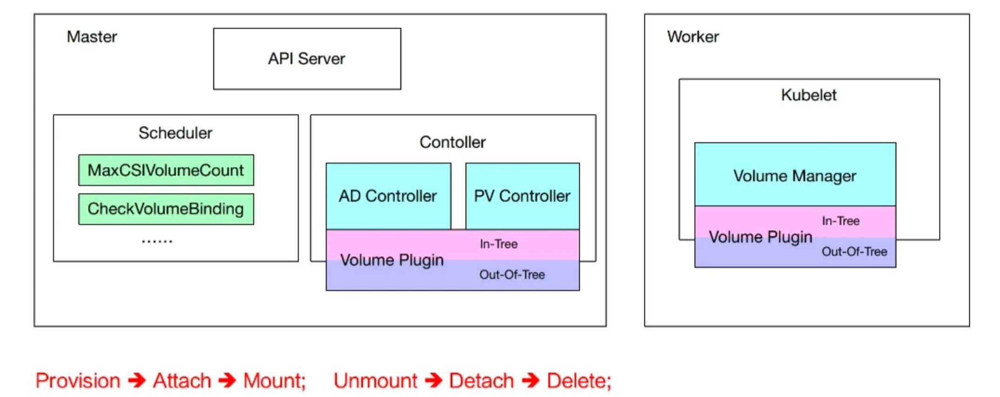

# K8S:Kubernetes 存储

{ width="800" }
/// caption
///

Kubernetes 卷为 Pod 中的容器提供了一种通过文件系统访问和共享数据的方式。通过卷可以实现：

- 数据持久性： 容器中的文件在磁盘上是临时存放的，这给在容器中运行较重要的应用带来一些问题。 当容器崩溃或被停止时，容器的状态不会被保存，因此在容器生命期内创建或修改的所有文件都将丢失。 在崩溃之后，kubelet 会以干净的状态重启容器。
- 共享存储： 当多个容器在一个 Pod 中运行并需要共享文件时，会出现另一个问题。 那就是在所有容器之间设置和访问共享文件系统可能会很有难度。

<!-- more -->

## K8s 存储架构
### 基础概念
#### 临时卷
- **EmptyDir** ： 是最简单的卷类型，它在 Pod 中创建一个临时目录，用于存储数据。 当 Pod 被删除时，EmptyDir 中的数据也会被删除。
- **ConfigMap** ： 是一种特殊的卷类型，它将 ConfigMap 中的数据作为文件挂载到容器中。 这意味着容器可以直接访问 ConfigMap 中的配置数据，而无需在容器中配置文件系统。
- **Secret** ： 是一种特殊的卷类型，它将 Secret 中的数据作为文件挂载到容器中。 这意味着容器可以直接访问 Secret 中的配置数据，而无需在容器中配置文件系统。

#### 持久化卷
- **PersistentVolume (PV)** ：集群管理员预先配置或动态创建的存储资源，是集群基础设施的一部分。PV 具有独立于 Pod 的生命周期，封装了底层存储实现的具体细节（如 NFS、iSCSI、云存储等）。
- **PersistentVolumeClaim (PVC)** ：用户请求和绑定 PV 的资源对象。PVC 定义了用户对存储的需求，包括存储大小、访问模式、存储类等。PVC 可以动态创建或绑定到现有的 PV。
- **StorageClass** ：定义了如何动态制备 PV 的模板。 管理员可以根据需要创建多个 StorageClass，每个 StorageClass 都有自己的制备策略和参数。

### 存储架构

 

## 参考
- [K8S官方文档：存储概念](https://kubernetes.io/docs/concepts/storage/)
- [从零开始入门 K8s：Kubernetes 存储架构及插件使用](https://www.infoq.cn/article/afju539zmbpp45yy9txj)
- https://jimmysong.io/book/kubernetes-handbook/storage/