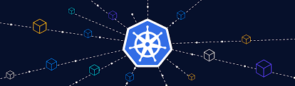
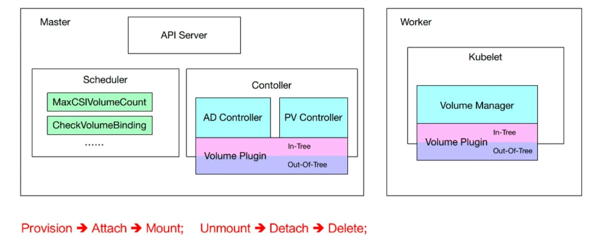
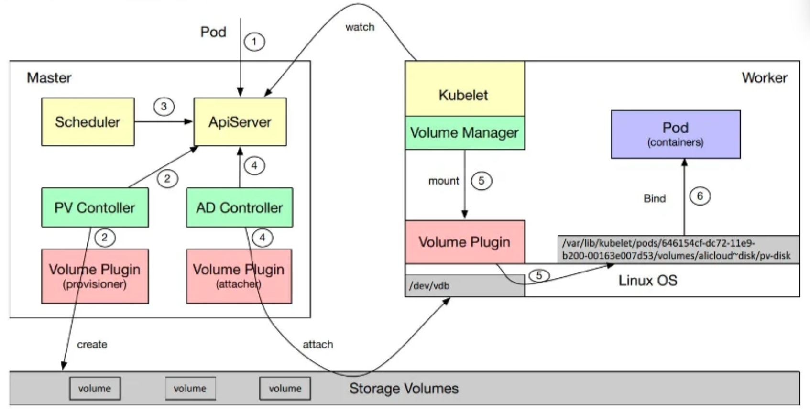
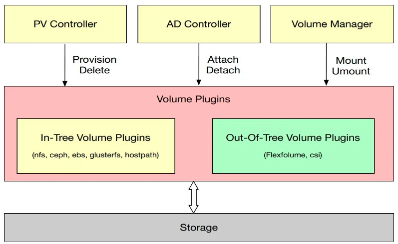
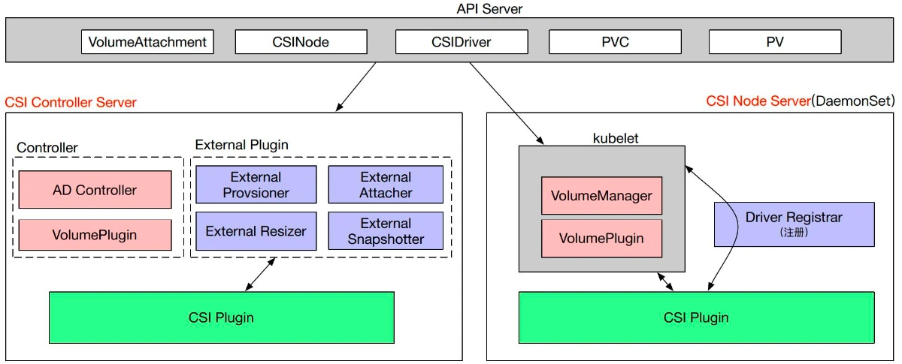
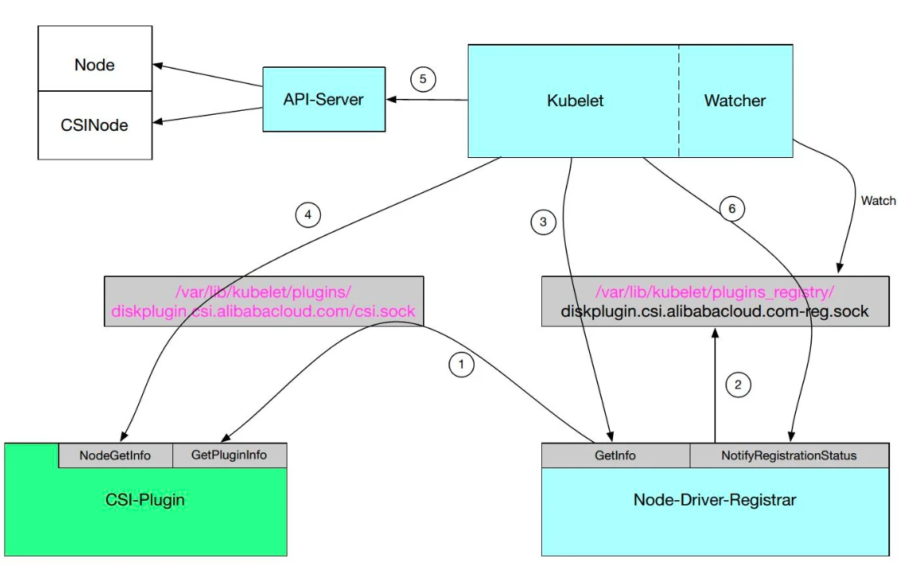

# Kubernetes 存储

{ width="1000" }
/// caption
///

Kubernetes 卷为 Pod 中的容器提供了一种通过文件系统访问和共享数据的方式。通过卷可以实现：

<!-- more -->

- 数据持久性： 容器中的文件在磁盘上是临时存放的，这给在容器中运行较重要的应用带来一些问题。 当容器崩溃或被停止时，容器的状态不会被保存，因此在容器生命期内创建或修改的所有文件都将丢失。 在崩溃之后，kubelet 会以干净的状态重启容器。
- 共享存储： 当多个容器在一个 Pod 中运行并需要共享文件时，会出现另一个问题。 那就是在所有容器之间设置和访问共享文件系统可能会很有难度。


## 基础概念
### 临时卷
- **EmptyDir** ： 是最简单的卷类型，它在 Pod 中创建一个临时目录，用于存储数据。 当 Pod 被删除时，EmptyDir 中的数据也会被删除。
- **ConfigMap** ： 是一种特殊的卷类型，它将 ConfigMap 中的数据作为文件挂载到容器中。 这意味着容器可以直接访问 ConfigMap 中的配置数据，而无需在容器中配置文件系统。
- **Secret** ： 是一种特殊的卷类型，它将 Secret 中的数据作为文件挂载到容器中。 这意味着容器可以直接访问 Secret 中的配置数据，而无需在容器中配置文件系统。

### 持久化卷
- **PersistentVolume (PV)** ：集群管理员预先配置或动态创建的存储资源，是集群基础设施的一部分。PV 具有独立于 Pod 的生命周期，封装了底层存储实现的具体细节（如 NFS、iSCSI、云存储等）。
- **PersistentVolumeClaim (PVC)** ：用户请求和绑定 PV 的资源对象。PVC 定义了用户对存储的需求，包括存储大小、访问模式、存储类等。PVC 可以动态创建或绑定到现有的 PV。
- **StorageClass** ：定义了如何动态制备 PV 的模板。 管理员可以根据需要创建多个 StorageClass，每个 StorageClass 都有自己的制备策略和参数。

## 存储架构
下面介绍一下 Kubernetes 中存储架构：  

 
图中各组件作用如下：

- **PV Controller**: 负责 PV/PVC 的绑定、生命周期管理，并根据需求进行数据卷的 Provision/Delete 操作；

- **AD Controller**：负责存储设备的 Attach/Detach 操作，将设备挂载到目标节点；

- **Volume Manager**：管理卷的 Mount/Unmount 操作、卷设备的格式化以及挂载到一些公用目录上的操作；

- **Volume Plugins**：它主要是对上面所有挂载功能的实现；

- **Scheduler**：实现对 Pod 的调度能力，会根据一些存储相关的的定义去做一些存储相关的调度；

PV Controller、AD Controller、Volume Manager 主要是进行操作的调用，而具体操作则是由 Volume Plugins 实现的。

当我们在一个 Pod 中使用 PVC 并挂载到容器的指定目录时，K8s 对该 Pod 的创建流程大致如下：



- 用户创建一个包含 PVC 的 Pod
- PV Controller 观察到 Pending 的 PVC， PV Controller 会去集群找一个合适的 PV，如果找不到，则调用 Volume Plugin 去做 Provision，之后创建一个 PV，将该 PV 与 PVC 绑定，为 PVC 打上 `"volume.kubernetes.io/selected-node"` 标签，供后续 Scheduler 使用。
- Scheduler 调度 Pod 到对应节点。
- AD Controller 调用 VolumePlugin 将 PV Attach 到节点上。
- Volume Manager 将 PV mount 到 Pod 在节点上对应的一个子目录下。
- 将该目录 mount 到 Pod 指定容器的挂载点下。

Volume Plugin 分为 in-tree 和 out-tree 两种：

- In-Tree 表示源码是放在 Kubernetes 内部的，和 Kubernetes 一起发布、管理与迭代，缺点及时迭代速度慢、灵活性差；

- Out-of-Tree 类的 Volume Plugins 的代码独立于 Kubernetes，它是由存储商提供实现的，目前主要有 Flexvolume 和 CSI 两种实现机制，可以根据存储类型实现不同的存储插件。



## CSI

CSI 是为第三方存储提供数据卷实现的抽象接口。



### CSI 对象

- CSINode：表示节点上的 CSI 插件信息，包括插件名称，node id，topologyKeys（表达卷与节点之间的拓扑亲和性），CSI 不需要主动创建 CSINode 对象，当 CSI 通过 kubelet 注册时，kubelet 会自动创建 CSINode 对象。[node-driver-registrar](https://kubernetes-csi.github.io/docs/node-driver-registrar.html) 实现了注册 CSI 插件这一功能。
    ```yaml
      apiVersion: storage.k8s.io/v1
    kind: CSINode
    metadata:
      name: node1
    spec:
      drivers:
      - name: mycsidriver.example.com
        nodeID: storageNodeID1
        topologyKeys: ['mycsidriver.example.com/regions', "mycsidriver.example.com/zones"]
    ```

- CSIDriver：表示 CSI 插件的注册信息，用来自定义 Kubernets 的行为，例如 `attachRequired: false` 表示通过该 CSI 创建的 PV 可以跳过 Attach/Detach 操作。安装一个 CSI 插件时，必须要创建 CSIDriver 对象。
    ```yaml
    apiVersion: storage.k8s.io/v1
    kind: CSIDriver
    metadata:
      name: mycsidriver.example.com
    spec:
      attachRequired: true
      podInfoOnMount: true
      fsGroupPolicy: File # added in Kubernetes 1.19, this field is GA as of Kubernetes 1.23
      volumeLifecycleModes: # added in Kubernetes 1.16, this field is beta
        - Persistent
        - Ephemeral
      tokenRequests: # added in Kubernetes 1.20. See status at https://kubernetes-csi.github.io/docs/token-requests.html#status
        - audience: "gcp"
        - audience: "" # empty string means defaulting to the `--api-audiences` of kube-apiserver
          expirationSeconds: 3600
      requiresRepublish: true # added in Kubernetes 1.20. See status at https://kubernetes-csi.github.io/docs/token-requests.html#status
      seLinuxMount: true # Added in Kubernetest 1.25.

    ```

### CSI 插件组件

- Node Plugin：主要包含 Kubelet 组件，包括 VolumeManager 和 VolumePlugin，它们会去调用 CSI Plugin 去做 mount 和 unmount 操作；另外一个组件 Driver Registrar 主要实现的是 CSI Plugin 注册的功能。

- Controller Plugin：与外部组件合作，处理 PV 的创建、删除、绑定、解绑等操作。

此外，还包含多个 External Plugin 组件，相当于官方实现了一些通用的功能，不用 CSI 开发者重复开发，直接使用这些组件即可，CSI 开发者可以专注于存储本身的实现。，每个组件和 CSI Plugin 组合的时候会完成某种功能。

- External Provisioner
- External Attacher
- External Resizer
- External Snapshoter
- Node-Driver-Registrar

|||
|--|--|
|External Provisioner + Controller Server |创建、删除 PV|
|External Attacher + Node Server |绑定、解绑 PV|
|External Resizer + Controller Server |调整 PV 大小|
|External Snapshoter + Controller Server |创建、删除 Snapshot|
|Node-Driver-Registrar + Node Server |注册 CSI 插件|

一个外部 CSI 插件需要实现一下三组 RPC：

- Identity Service
- Controller Service
- Node Service

各个 RPC 被调用的时机及应该实现的功能见 [CSI Spec](https://github.com/container-storage-interface/spec/blob/master/spec.md)

一个典型的 Volume 生命周期内 CSI 的 RPC 调用：
```bash
   CreateVolume +------------+ DeleteVolume
 +------------->|  CREATED   +--------------+
 |              +---+----^---+              |
 |       Controller |    | Controller       v
+++         Publish |    | Unpublish       +++
|X|          Volume |    | Volume          | |
+-+             +---v----+---+             +-+
                | NODE_READY |
                +---+----^---+
               Node |    | Node
              Stage |    | Unstage
             Volume |    | Volume
                +---v----+---+
                |  VOL_READY |
                +---+----^---+
               Node |    | Node
            Publish |    | Unpublish
             Volume |    | Volume
                +---v----+---+
                | PUBLISHED  |
                +------------+

Figure 6: The lifecycle of a dynamically provisioned volume, from
creation to destruction, when the Node Plugin advertises the
STAGE_UNSTAGE_VOLUME capability.
```

### CSI 注册过程


## 参考
- [K8S官方文档：存储概念](https://kubernetes.io/docs/concepts/storage/)
- [从零开始入门 K8s：Kubernetes 存储架构及插件使用](https://www.infoq.cn/article/afju539zmbpp45yy9txj)
- https://jimmysong.io/book/kubernetes-handbook/storage/
- [CSI Spec](https://github.com/container-storage-interface/spec/blob/master/spec.md)
- [CSI架构和原理](https://www.cnblogs.com/hgzero/p/17464313.html)
- [云计算K8s组件系列—- 存储CSI](https://kingjcy.github.io/post/cloud/paas/base/kubernetes/k8s-store-csi/)