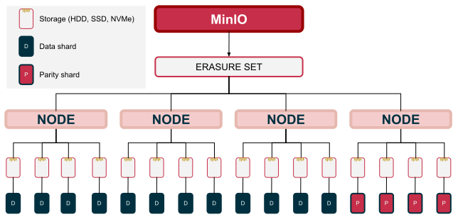

# MinIO 笔记（1）: 基本架构

<!-- more -->

## 基本介绍

MinIO 是一个 S3 兼容的对象存储服务，基本架构如下：

客户端通过标准的 S3 协议与 MinIO 进行交互，MinIO 服务端主要可以分为以下几个模块：

- S3 协议层：提供 S3 兼容的 RESTful API 接口，与客户端进行交互。
- Object Layer：提供对象存储的核心功能，包括对象的上传、下载、删除、元数据管理，EC 编码等。 Object Layer 内部分为以下层次：Pool -> Set -> Obeject。
- Storage Layer：提供对磁盘文件的操作接口。
- 节点通信：提供节点之间的通信，包括 Grid、REST 两种方式。
- 其他组件：包括如数据扫描、数据恢复、日志、监控等功能模块。

MinIO 通过 Erasure Code 编码实现数据冗余，默认采用 Reed-Solomon 编码，每个对象在上传时会被切分成多个数据分片和校验分片，存储在不同的节点上，以实现数据的冗余存储和恢复。各节点完全对称，不存在主从关系。

在存储层，其拓扑分为存储池（Pool）、擦除集（Set）、对象（Object）三层，一个 MinIO 部署可以包含多个存储池且可以进行扩展以增加存储容量。每个存储池可以包含多个擦除集，一个存储池的擦除集在创建完成之后不能再更改（与 Object 寻址相关，根据哈希值确定 Object 所在的擦除集）。每个擦除集可以包含多个对象，由对象提供 EC 编码信息，确定数据分片和校验分片的分布。

### 部署
MinIO 支持不同的部署方式：
- 单节点单磁盘（SNSD）：本地开发、测试用，没有数据冗余。
- 单节点多磁盘（SNMD）：能容忍磁盘级的故障。
- 多节点多磁盘（MNMD）：提供数据冗余和高可用性。

在生产环境中，建议使用多节点多磁盘的部署方式，以提高系统的可用性和性能。部署时，对于存储有以下几个注意事项：

- 使用本地存储：不要使用 NAS，NFS 等网络文件系统。
- 使用 XFS 文件系统。
- 使用相同的磁盘类型及容量，如果容量不一致，整个 MinIO 部署将采用较小的容量来计算整个部署的总容量。
- 磁盘挂载的持久化，通过 `/etc/fstab` 来保证重启后磁盘能够自动挂载且保持一致。

### 可用性
MinIO 的数据可用性主要由 Erasure Code 编码机制保证，在 EC:M 的配置下，最多能容忍 M 个节点失效，而不影响数据的可用性。
$$ N (ERASURE SET SIZE) = K (DATA) + M (PARITY) $$

{ width="1000" }
/// caption
EC:4
///

如上部署，最多可容忍 4 块磁盘失效，而不影响数据的读写。此外，存在一个特殊的情况，如果 `M = N/2`，那么在这种情况下，需要 K+1 个磁盘在线，才能处理写请求。

## 使用
MinIO 是兼容标准 S3 协议的对象存储服务，因此可以使用标准的 S3 客户端进行交互。

| 关于 MinIO 的 S3 兼容性可以在[MinIO S3 兼容性](https://min.io/docs/minio/linux/reference/s3-api-compatibility.html)中查看。

- [AWS SDK](https://github.com/aws/aws-sdk-go-v2)
- [MinIO SDK](https://github.com/minio/minio-go)
- MinIO Client (mc): MinIO 提供的一个 CLI 工具，可以用类似 UNIX 文件系统命令的方式与 MinIO 中的对象进行交互。
- MinIO Console: MinIO 提供的一个 Web 界面，用于管理和监控 MinIO 集群。