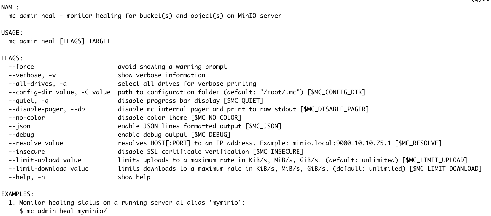

# MinIO 笔记（7）: 数据修复


<!-- more -->

## 概念
Healing 是指 MinIO 恢复已损坏、部分丢失的对象的能力。损坏的类型包括：

- 驱动器故障。
- 文件系统故障。
- bitrot。

MinIO 会在以下情况下，触发数据修复流程：

### GET请求期间
MinIO 会在每次使用 `GET` 或 `HEAD` 操作请求对象时，自动检查对象数据分片的一致性。对于受版本控制的存储桶，MinIO 还会在 `PUT` 操作作期间检查一致性。

如果发现所有数据分片都完好无损，则 MinIO 将根据数据分片返回对象数据，而不检查相应的奇偶校验分片。

如果对象的数据分片缺失或损坏，则 MinIO 会使用可用的 EC 校验分片计算对象数据进行返回（同时将数据修复任务加入 mrf 修复序列中，异步执行 Object 修复）。丢失的分片数不能超过 EC 校验数，否则无法恢复对象。如果数据分配和 EC 校验分片都有丢失或损坏，MinIO 将恢复 EC 校验分片，前提是有足够的其他 EC 校验分片来为对象提供服务。

### Scanner扫描期间
MinIO 使用对象扫描程序来执行许多与对象相关的任务。其中一项任务会检查对象的完整性，如果发现对象已损坏或损坏，则会修复它们。
在每次扫描过程中，MinIO 使用对象名称的哈希值与 scanner 周期数做取模计算，默认每个 Object 会在每 1024 轮被选中，执行 Heal 操作。
如果发现任何对象丢失了分片，MinIO 会从可用分片中修复该对象。默认情况下，MinIO 不使用扫描程序检查 bitrot 损坏。这可能是一个比较重的操作，并且跨多个磁盘的 bitrot 风险很低。

### 手动触发
管理员可以使用 `mc admin heal` 启动完整的系统修复。该程序非常耗费资源，通常不需要。

## 实现
### 核心API及其实现

MINIO的数据恢复能力都是构建在这几个核心的 API 之上的，有些恢复场景是将这些 API 集成在框架中，有些是直接调用 API。

```go
// ObjectLayer implements primitives for object API layer.
type ObjectLayer interface {
// ...
  // Healing operations.
  HealFormat(ctx context.Context, dryRun bool) (madmin.HealResultItem, error)
  HealBucket(ctx context.Context, bucket string, opts madmin.HealOpts) (madmin.HealResultItem, error)
  HealObject(ctx context.Context, bucket, object, versionID string, opts madmin.HealOpts) (madmin.HealResultItem, error)
  HealObjects(ctx context.Context, bucket, prefix string, opts madmin.HealOpts, fn HealObjectFn) error
  CheckAbandonedParts(ctx context.Context, bucket, object string, opts madmin.HealOpts) error
// ...
}
```

### HealObject
`HealObject` 从 Pool 层开始调用，并发请求每个 Pool，每个 Pool 内按照哈希确定 Object 所属 Set，对应 Set 执行修复流程，修复主流程如下：


上述流程中：

- 判断是否是悬空对象：如果没有一个合法的元数据信息，则不能确定该目录下的是什么，不能认为是 `Dangling Object`；对于存在合法元数据的对象，需要判断缺失的部分是否大于 EC 中的校验数，大于则无法恢复，认为该 Object 是一个 `Dangling Object`。


### HealBucket

### 相关数据结构
#### healSequence
一个数据恢复序列，保存数据修复过程中的各种状态及统计指标。本身不处理恢复任务，将恢复任务转发给 `healRoutine` 处理。

```go
type healSequence struct {
    // bucket, and object on which heal seq. was initiated
    bucket, object string

    // Report healing progress
    reportProgress bool

    // time at which heal sequence was started
    startTime time.Time

    // time at which heal sequence has ended
    endTime time.Time

    // Heal client info
    clientToken, clientAddress string

    // was this heal sequence force started?
    forceStarted bool

    // heal settings applied to this heal sequence
    settings madmin.HealOpts

    // current accumulated status of the heal sequence
    currentStatus healSequenceStatus

    // channel signaled by background routine when traversal has
    // completed
    traverseAndHealDoneCh chan error

    // canceler to cancel heal sequence.
    cancelCtx context.CancelFunc

    // the last result index sent to client
    lastSentResultIndex int64

    // Number of total items scanned against item type
    scannedItemsMap map[madmin.HealItemType]int64

    // Number of total items healed against item type
    healedItemsMap map[madmin.HealItemType]int64

    // Number of total items where healing failed against item type
    healFailedItemsMap map[madmin.HealItemType]int64

    // The time of the last scan/heal activity
    lastHealActivity time.Time

    // Holds the request-info for logging
    ctx context.Context

    // used to lock this structure as it is concurrently accessed
    mutex sync.RWMutex
}
```

#### allHealState

在内存中保存所有的数据恢复序列状态，以及本地磁盘探测及恢复状态（用于新磁盘的格式化及数据恢复）。

- `healSeqMap`： key为数据恢复作用的路径，同一路径只能存在一个修复修复序列。
- `healLocalDisks`，`healStatus`用于监控本地磁盘的状态，对新磁盘进行格式化和数据恢复。

每个server在内存中保存两个全局的`allHealState`变量：

- `globalBackgroundHealState`:  只有一个修复序列(`bgSeq`,id:"0000-0000-0000-0000")，用来处理新磁盘格式化等后台自动进行的数据修复任务。

- `globalAllHealState`:  对应Admin API手动触发的修复任务，每次新的Heal请求会在该state中新增seq（不同的Path）。

```go
type allHealState struct {
    sync.RWMutex

    // map of heal path to heal sequence
    healSeqMap map[string]*healSequence // Indexed by endpoint
    // keep track of the healing status of disks in the memory
    //   false: the disk needs to be healed but no healing routine is started
    //    true: the disk is currently healing
    healLocalDisks map[Endpoint]bool 
    healStatus     map[string]healingTracker // Indexed by disk ID
}
```

#### healingTracker

`healingTracker` 用来持久化一次新磁盘格式化和数据恢复过程中的相关信息，对应 `.minio.sys/buckets/.healing.bin`文件，记录的内容包括：

```go
type healingTracker struct {
    disk StorageAPI    `msg:"-"`
    mu   *sync.RWMutex `msg:"-"`

    ID         string    // Disk ID
    PoolIndex  int       // Pool index
    SetIndex   int       // Set index
    DiskIndex  int       // Disk index
    Path       string    // Path to drive
    Endpoint   string    // Endpoint of drive
    Started    time.Time
    LastUpdate time.Time

    ObjectsTotalCount uint64
    ObjectsTotalSize  uint64

    ItemsHealed uint64
    ItemsFailed uint64

    BytesDone   uint64
    BytesFailed uint64

    // Last object scanned.
    Bucket string `json:"-"`
    Object string `json:"-"`

    // Numbers when current bucket started healing,
    // for resuming with correct numbers.
    ResumeItemsHealed  uint64 `json:"-"`
    ResumeItemsFailed  uint64 `json:"-"`
    ResumeItemsSkipped uint64 `json:"-"`
    ResumeBytesDone    uint64 `json:"-"`
    ResumeBytesFailed  uint64 `json:"-"`
    ResumeBytesSkipped uint64 `json:"-"`

    // Filled on startup/restarts.
    QueuedBuckets []string

    // Filled during heal.
    HealedBuckets []string

    // ID of the current healing operation
    HealID string

    ItemsSkipped uint64
    BytesSkipped uint64

    RetryAttempts uint64

    Finished bool // finished healing, whether with errors or not

    // Add future tracking capabilities
    // Be sure that they are included in toHealingDisk
}
```

#### healRoutine
接受`healtask`，处理数据修复任务，全局一个实例（`globalBackgroundHealRoutine`）多个worker，worker数量默认为GOMAXPROCS/2，可以通过`_MINIO_HEAL_WORKERS`环境变量指定。

```go
type healRoutine struct {
    tasks   chan healTask
    workers int
}
```

#### healTask

一次heal任务，包括heal作用的对象及相关参数，通过channel传递给`healRoutine`处理。

```go
// healTask represents what to heal along with options
//
//        path: '/' =>  Heal disk formats along with metadata
//        path: 'bucket/' or '/bucket/' => Heal bucket
//        path: 'bucket/object' => Heal object
type healTask struct {
    bucket    string
    object    string
    versionID string
    opts      madmin.HealOpts
    // Healing response will be sent here
    respCh chan healResult
}
```

#### mrfState

`mrfState` 用来保证一个 Object 的分片完整性，该子系统启动时会监听一个任务队列，由该队列输入修复任务，一个修复任务表示由一次没有完全成功（满足 quorum 要求）的上传或删除动作，导致的 MinIO 节点之间的分片数据不一致，触发修复任务入队的时机为 GET 请求或在受版本控制的 Bucket 中的 PUT 请求。

```go
// 用于表示对象成功上传或删除，但未完全写入所有磁盘的情况，只要满足法定人数即可。
type PartialOperation struct {
    Bucket              string
    Object              string
    VersionID           string
    Versions            []byte
    SetIndex, PoolIndex int
    Queued              time.Time
    BitrotScan          bool
}
```

### Heal 场景
#### 新磁盘格式化及数据恢复
一个 erasureSet 中的磁盘在启动之后是不可更改的，但可能出现数据盘损坏，需要替换磁盘的场景，在该场景下，需要对新磁盘进行格式化，及对应的数据恢复。

MinIO 默认会启动一个定时任务（默认频率为 10s 一次），该定时任务通过定期获取本地磁盘的修复状态，来保证检测到的新磁盘被修复。磁盘的修复状态存储在一个全局 Map 中：

> key:  endpoint，存放 PoolIdx, SetIdx, DiskIdx 等信息。
  val：标识是否已经被修复
    - false：未修复，需要执行 Heal。
    - true：已修复。

```go
type allHealState struct {
    sync.RWMutex

    // map of heal path to heal sequence
    healSeqMap map[string]*healSequence // Indexed by endpoint
    // keep track of the healing status of disks in the memory
    //   false: the disk needs to be healed but no healing routine is started
    //    true: the disk is currently healing
    healLocalDisks map[Endpoint]bool 
    healStatus     map[string]healingTracker // Indexed by disk ID
}
```

该状态表的更新由另一个定时任务完成。服务启动后，根据启动命令创建对应的 erasureSets，在每个 erasureSet 内部，会开启一个定时任务（默认频率 15s 一次，需要比上面的任务定时间隔大）去重新连接断开的 Endpoint 来跟踪它们的状态。

#### 探测新磁盘

定时任务定期获取所有磁盘信息，判断磁盘是否在线，针对掉线的磁盘需要重新建立连接。对于本地磁盘是否在线的判断方法为：读取 format.json 文件，获取文件中的 diskID，判断与内存中的值是否一致，不一致，则证明不在线（可能是发生了磁盘替换，该磁盘上不存在 format.json 文件）。

在对离线的磁盘进行重新连接的过程中，如果发现为本地磁盘且是一个未被格式化（无 format.json 文件），需要将该磁盘的状态在全局表中更新。

#### 新磁盘修复

当定时任务获取到新磁盘列表之后，首先会对全部的磁盘执行 `HealFormat` 操作，之后并行的去修复新磁盘（同一个 erasureSet 互斥，不同 erasureSet 并行）。

修复流程为：
- 获取锁，确保一个 erasureSet 中的磁盘不会并行修复。
- 获取所有 bucket，将 bucket 修复任务传入 `globalBackgroundHealState` 的 seq（"0000-0000-0000-0000"）中，先将所有 bucket 恢复，此时 bucket 中的 object 尚未恢复。
- 并发调用 `HealObject` 恢复各 bucket 中的 object 数据。

新磁盘修复过程中，如果发生错误，则不会将磁盘状态更新为已修复，需要等待下一次定时任务触发修复。

若有 Object 修复失败，会返回重试错误，最多四次。

#### GET/HEAD请求修复 

##### 请求触发修复

MinIO 处理对 Object 的 GET、HEAD 请求时，会首先并发获取 Object 的元数据，即读取每个 server 上对应 Object 目录下的 xl.meta 文件，如果发现元数据有损坏，则会尝试修复该 Object，即将该 Object 加入 mrf 修复队列中。

元数据获取完成之后，开始获取 Object 数据，读取顺序为优先数据分片，数据分片不足，读取校验分片。如果 Object 的数据分片出现损坏、缺失，则会触发 MinIO 的修复机制；如果数据分片未损坏，校验分片损坏，则不会触发。

MinIO 中每个 Object 的分片分布在 object 下的 xl.meta 文件中记录：

```json
{
  "Versions": [
    {
...
      "Metadata": {
        "Type": 1,
        "V2Obj": {
          "CSumAlgo": 1,
          "DDir": "BRBLN//hRVOCokzO0165qg==",
          "EcAlgo": 1,
          "EcBSize": 1048576,
          "EcDist": [
            2,
            3,
            1
          ],
...
        },
        "v": 0
      }
    }
  ]
}
```

在我们使用 EC:1 的配置下，数据分片有两个，校验分片有一个，如上的 [2,3,1] 表示：数据分片在第3,1号 minio server 上，校验分片在 minio 2 上；即该数组的 index 表示 minio server，index 对应的值表示数据分片的序号。

在对 Object 进行 GET 请求时，我们请求分片数据的顺序，会按照该分布排序，优先获取数据分片。

```go
// cmd/erasure-decode.go
func (p *parallelReader) Read(dst [][]byte) ([][]byte, error){
// ...
    for i := 0; i < p.dataBlocks; i++ {
        // Setup read triggers for p.dataBlocks number of reads so that it reads in parallel.
        readTriggerCh <- true
    }
// ...
}
```

分片数据的读取是并行的，这里可以看到，先启动与数据分片数量相同的 goroutine 去获取数据。数据分片读取错误才会继续触发读操作，去获取校验分片的数据。

```go
// cmd/erasure-decode.go
func (p *parallelReader) Read(dst [][]byte) ([][]byte, error){
// ...
    n, err := rr.ReadAt(p.buf[bufIdx], p.offset)
    if err != nil {
        switch {
        case errors.Is(err, errFileNotFound):
                atomic.StoreInt32(&missingPartsHeal, 1)
        case errors.Is(err, errFileCorrupt):
                atomic.StoreInt32(&bitrotHeal, 1)
        case errors.Is(err, errDiskNotFound):
                atomic.AddInt32(&disksNotFound, 1)
        }

        // This will be communicated upstream.
        p.orgReaders[bufIdx] = nil
        if br, ok := p.readers[i].(io.Closer); ok {
                br.Close()
        }
        p.readers[i] = nil

        // Since ReadAt returned error, trigger another read.
        readTriggerCh <- true
        return
    }
// ...
}
```

读取成功，但是返回错误，证明数据分片有损坏或丢失，会触发分片修复流程，将该操作加入前面提到的 `globalMRFState` 任务队列中。

```go
// cmd/erasure-object.go
func (er erasureObjects) getObjectWithFileInfo(ctx context.Context, bucket, object string, startOffset int64, length int64, writer io.Writer, fi FileInfo, metaArr []FileInfo, onlineDisks []StorageAPI) error{
// ...
    written, err := erasure.Decode(ctx, writer, readers, partOffset, partLength, partSize, prefer)
    // Note: we should not be defer'ing the following closeBitrotReaders() call as
    // we are inside a for loop i.e if we use defer, we would accumulate a lot of open files by the time
    // we return from this function.
    closeBitrotReaders(readers)
    if err != nil {
        // If we have successfully written all the content that was asked
        // by the client, but we still see an error - this would mean
        // that we have some parts or data blocks missing or corrupted
        // - attempt a heal to successfully heal them for future calls.
        if written == partLength {
            if errors.Is(err, errFileNotFound) || errors.Is(err, errFileCorrupt) {
                healOnce.Do(func() {
                    globalMRFState.addPartialOp(PartialOperation{
                        Bucket:     bucket,
                        Object:     object,
                        VersionID:  fi.VersionID,
                        Queued:     time.Now(),
                        SetIndex:   er.setIndex,
                        PoolIndex:  er.poolIndex,
                        BitrotScan: errors.Is(err, errFileCorrupt),
                    })
                })
                // Healing is triggered and we have written
                // successfully the content to client for
                // the specific part, we should `nil` this error
                // and proceed forward, instead of throwing errors.
                err = nil
            }
        }
        if err != nil {
            return toObjectErr(err, bucket, object)
        }
    }
// ...
}
```

#### MRF 工作流程

MRF 的功能较为明确，即调用 Heal 核心 API，处理分片数据不完整的情况。在服务启动时，MRF 会创建一个 goroutine，来监听 Op channel，将 Op channel 传入的请求转换为 `healtask` 放到 bgSeq 中交由 `healRoutine` 处理。

```go
// healObject sends the given object/version to the background healing workers
func healObject(bucket, object, versionID string, scan madmin.HealScanMode) error {
    // Get background heal sequence to send elements to heal
    bgSeq, ok := globalBackgroundHealState.getHealSequenceByToken(bgHealingUUID)
    if ok {
        return bgSeq.healObject(bucket, object, versionID, scan)
    }
    return nil
}
```

此外，MRF的状态在服务停止时会持久化到磁盘上，对应 .minio.sys/buckets/.heal/mrf/list.bin 文件，记录尚未完成的 PartialOp，在服务启动时会加载该文件，恢复中断的任务。

#### Scanner修复

MinIO 中的 data-scanner 模块主要作用是用来搜集 Object 相关指标，例如 Bucket 用量、Object 数量等。另外，在设计上也用于恢复数据，该恢复的触发是周期性的（1/1024），且不会处理 bitrot。

```go
// cmd/data-scanner.go
func (f *folderScanner) scanFolder(ctx context.Context, folder cachedFolder, into *dataUsageEntry) error {
    // ...
    item.heal.enabled = thisHash.modAlt(f.oldCache.Info.NextCycle/folder.objectHealProbDiv, f.healObjectSelect/folder.objectHealProbDiv) && f.shouldHeal()
    item.heal.bitrot = f.scanMode == madmin.HealDeepScan
    // ...
}
```

> 由于 `shouldHeal()` 方法存在 bug，导致总是返回 false，因此目前的版本 scan 过程中不会触发数据修复。

在 enabled 被置为 true 之后，后续扫描到该 Object 时，会对该 Object 调用 HealObject 尝试进行数据恢复。

#### Admin 请求手动修复

MinIO 提供 Admin API，进行手动触发数据恢复。



实现为将 Heal 请求组织成一个 Seq，放入全局的 `globalAllHealState` 的 healSeqMap 中，由后台 worker 去执行数据恢复任务。
此外，在 API Handler 内，会对请求 heal 的 Path 进行校验，如果当前队列中已经有同名的 Seq，则返回当前 Seq 的状态，不会重复添加任务。
恢复任务的执行

在创建一个 Seq 之后，会将 Seq 放入 `globalAllHealState` 的全局表中，并同时启动一个后台 routine，该 routine 执行遍历操作，对给定的 path 进行遍历，获取所有的 bucket，将 bucket 恢复任务交由 `globalBackgroundHealRoutine` 处理；同时更新 Seq 中的修复状态。

## 验证
### 读取分片缺失的 Object

通过 S3API，分片上传 1GB 的文件，分片大小指定为 64MB。


查看 xl.meta 数据，确定其数据分片与校验码分片分布：

```json
{
  "Versions": [
    {
      "Metadata": {
         ...
        "Type": 1,
        "V2Obj": {
          "CSumAlgo": 1,
          "DDir": "jTuTge1vSGWY5WTxb39pQw==",
          "EcAlgo": 1,
          "EcBSize": 1048576,
          "EcDist": [
            2,
            3,
            1
          ],
          "EcIndex": 2,
          "EcM": 2,
          "EcN": 1,
          "ID": "AAAAAAAAAAAAAAAAAAAAAA==",
          "MTime": 1748331420006011629
          ...
      }
    }
  ]
}
```

可见其数据分片在 3,1 号节点上，校验分片在 2 号节点上。

- 删除 3 号节点部分数据，验证数据分片损坏，GET 请求会修复数据。
  删除部分 part:
  
  通过 S3API 触发 GET 请求，读取成功。查看目标节点上分片数据，已恢复：
  

- 删除 2 号节点部分数据，验证校验分片损坏，不会进行修复。
  删除部分 part:
  
  通过 S3API 触发 GET 请求，读取成功。查看目标节点上分片数据，未恢复：
  

### 验证手动恢复

对上述校验分片缺失的 Bucket 手动执行 heal 操作：


查看目标节点上分片数据，已恢复：

