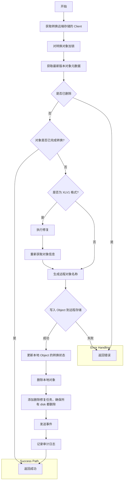

# MinIO 笔记（8）：对象生命周期管理


<!-- more -->

## 概念
MinIO 中的生命周期管理（ILM）的行为和语法都继承自 [AWS S3](https://docs.aws.amazon.com/AmazonS3/latest/userguide/object-lifecycle-mgmt.html) 。ILM 规则在 MinIO 的 Bucket 层级上创建，创建的规则将应用于该 Bucket 中的现有和新增的 Object。ILM 规则包括对象转换和对象过期两类，MinIO 可以基于时间自动转换或过期删除对象。

- **对象转换**：通过对象转换规则，可以实现对象的冷存储转移，例如在对象 30 天后，将对象从标准存储转换为冷存储，以实现成本控制。转换之后的 Object 在本地只会保留元数据，可以通过 `RestoreObject` 恢复本地数据，恢复的数据会在 `RestoreExpire` 时间后过期删除。
- **对象过期**：通过对象过期规则，可以实现对象的自动删除，例如在对象 365 天后，将对象删除。

## MinIO 中的 ILM 规则及实现
### ILM 规则
MinIO 中关于 ILM 规则的语法与 AWS S3 相同，具体可以参考 [AWS S3 文档](https://docs.aws.amazon.com/AmazonS3/latest/userguide/intro-lifecycle-rules.html) 。

一个规则主要包括：

- 规则元数据：ID、启用还是禁用
- Filter：对作用对象的筛选，基于对象名前缀、对象大小、标签、Tag 等。
- Expiration：过期规则，针对受版本控制的 Bucket，过期规则只作用在对象的当前版本。
- Transition：转换规则，针对受版本控制的 Bucket，转换规则只作用在对象的当前版本。
- DelMarkerExpiration：针对受版本控制的 Bucket，删除有 DeleteMarker 的 Object 所有版本。
- NoncurrentVersionTransition：针对受版本控制的 Bucket，基于对象变为非当前版本之后的时间运用转换规则。
- NoncurrentVersionExpiration：针对受版本控制的 Bucket，基于对象变为非当前版本之后的时间运用过期规则。

对于受版本控制的 Bucket：

- 过期操作只会作用在对象的当前版本。
- 如果存在一个或多个对象版本并且当前版本是 DeleteMarker，不会执行任何操作。
- 如果只有一个对象版本，且该版本是 DeleteMarker，过期操作会删除该对象。
- 如果设置了 DelMarkerExpiration 规则，则会在对象的 DeleteMarker 版本过期后，删除该对象的所有版本。

### ILM 实现
MinIO 中 ILM 的作用时机取决于 Scanner 扫描到该 Object 的时机，在 16 次扫描的范围内，MinIO 会检查命名空间中的每个对象，检查作用在 Object 上的生命周期规则是否生效。实现上，通过对扫描的 Obejct 注册一个回调：
```go
func (i *scannerItem) applyActions(ctx context.Context, objAPI ObjectLayer, objInfos []ObjectInfo, lr lock.Retention, sizeS *sizeSummary, fn actionsAccountingFn) 
```
`objInfos` 是一个 Object 的所有版本的元数据列表，回调内部实现了对对象生命周期规则的检查，如果命中，则执行对应的动作。Action 分为以下几类：
```go
const (
	// NoneAction means no action required after evaluating lifecycle rules
	NoneAction Action = iota
	// DeleteAction means the object needs to be removed after evaluating lifecycle rules
	DeleteAction
	// DeleteVersionAction deletes a particular version
	DeleteVersionAction
	// TransitionAction transitions a particular object after evaluating lifecycle transition rules
	TransitionAction
	// TransitionVersionAction transitions a particular object version after evaluating lifecycle transition rules
	TransitionVersionAction
	// DeleteRestoredAction means the temporarily restored object needs to be removed after evaluating lifecycle rules
	DeleteRestoredAction
	// DeleteRestoredVersionAction deletes a particular version that was temporarily restored
	DeleteRestoredVersionAction
	// DeleteAllVersionsAction deletes all versions when an object expires
	DeleteAllVersionsAction
	// DelMarkerDeleteAllVersionsAction deletes all versions when an object with delete marker as latest version expires
	DelMarkerDeleteAllVersionsAction
	// ActionCount must be the last action and shouldn't be used as a regular action.
	ActionCount
)
```
整体的匹配流程为：

- 当前 Object 是从远端取回的的，且以过去，添加 DeleteRestoredVersionAction 事件。
- 遍历通过 Filter 筛选的规则，检查是否命中。
  * 针对只有一个 Version 且为 DeleteMarker 的对象，如果到了过期时间，添加 DeleteVersionAction 事件，并直接跳出，因为不会有其他冲突的事件了。
  * 如果是 Object 的当前版本且是 DeleteMarker，且设置了 DelMarkerExpiration，计算下次过期时间，添加 DeleteVersionAction 事件。
  * 针对非当前版本 Object 的 ILM 规则应用，添加 DeleteVersionAction 或 TransitionVersionAction 事件。
  * 针对当前版本 Object 的 ILM 规则应用，添加 DeleteAction 或 TransitionAction 事件。
- 对所有事件进行排序，返回优先级最高的事件。

排序的依据是：
```go 
slices.SortFunc(events, func(a, b Event) int {
  // Prefer Expiration over Transition for both current
  // and noncurrent versions when,
  // - now is past the expected time to action
  // - expected time to action is the same for both actions
  if now.After(a.Due) && now.After(b.Due) || a.Due.Equal(b.Due) {
    switch a.Action {
    case DeleteAllVersionsAction, DelMarkerDeleteAllVersionsAction,
      DeleteAction, DeleteVersionAction:
      return -1
    }
    switch b.Action {
    case DeleteAllVersionsAction, DelMarkerDeleteAllVersionsAction,
      DeleteAction, DeleteVersionAction:
      return 1
    }
    return -1
  }

  // Prefer earlier occurring event
  if a.Due.Before(b.Due) {
    return -1
  }
  return 1
})
```


#### 对象转换
对象转换的过程是异步执行的，MinIO 维护一个转换队列，命中转化规则的对象会被加入队列，队列中的对象会在后台任务（worker 的数量可以通过 `ilm transition_workers` 配置项或 `MINIO_ILM_TRANSITION_WORKERS` 环境变量指定，默认 100）中执行转换操作。

后台 worker 的通过 `TransitionObject` 方法执行转换操作，转换操作的过程是：

转换状态在 Object 的元数据中 `TransitionStatus` 字段表示，取值：

- TransitionComplete(complete)：对象已完成转换
- TransitionPending(pending)：对象正在转换中

#### 对象过期
对象过期的处理流程与对象转换类似，都是向一个任务队列中添加任务，后台 worker 执行对应的任务。过期的对象可能有如下情况：

- 普通对象
  * 非版本控制对象：直接删除
  * 版本控制对象：删除当前版本
- 已转换的对象：需要删除远端存储
- 已转换的对象且本地执行了 Restore：本地和远端都要删除
- 受版本控制的非当前版本对象

## 管理 ILM 规则
可以通过 MinIO 的 [mc 工具](https://min.io/docs/minio/linux/reference/minio-mc/mc-ilm.html)来创建和管理 ILM 规则。

添加一个远端存储层：
```shell
 mc ilm tier add minio myminio WARM-MINIO-TIER                     \
                               --endpoint https://warm-minio.com   \
                               --access-key ACCESSKEY              \
                               --secret-key SECRETKEY              \
                               --bucket mybucket                   \
                               --prefix myprefix/
```
查看远端存储层：
```shell
mc ilm tier ls minio

 mc ilm tier info myminio WARM-TIER
```
移除远端存储层：
```shell
mc ilm tier rm minio myminio WARM-TIER
```

添加一个生命周期规则：
```shell
mc [GLOBALFLAGS] ilm rule add                               \
                 [--prefix string]                          \
                 [--tags string]                            \
                 [--expire-days "integer"]                  \
                 [--expire-all-object-versions]             \
                 [--expire-delete-marker]                   \
                 [--transition-days "string"]               \
                 [--transition-tier "string"]               \
                 [--noncurrent-expire-days "integer"]       \
                 [--noncurrent-expire-newer "integer"]      \
                 [--noncurrent-transition-days "integer"]   \
                 [--noncurrent-transition-tier "string"]    \
                 [--site-gt "string"]                       \
                 [--size-lt "string"]                       \
                 ALIAS
```
例如，添加一个基于时间的对象转换规则，该规则将满 90 天的当前版本转换为 `MINIOTIER-1` 存储层，且将 45 天前的非当前版本转换为 `MINIOTIER-2` 存储层：
```shell
mc ilm rule add --prefix "doc/" --transition-days "90" --transition-tier "MINIOTIER-1"  \
       --noncurrent-transition-days "45" --noncurrent-transition-tier "MINIOTIER-2"    \
       myminio/mybucket
```

编辑 ILM 规则：
```
mc [GLOBALFLAGS] ilm rule edit                                       \
                 --id "string"                                       \
                 [--prefix "string"]                                 \
                 [--enable]                                          \
                 [--disable]                                         \
                 [--expire-all-object-versions]                      \
                 [--expire-days "string"]                            \
                 [--expire-delete-marker]                            \
                 [--transition-days "string"]                        \
                 [--transition-tier "string"]                        \
                 [--noncurrent-expire-days "string"]                 \
                 [--noncurrent-expire-newer "string"]                \
                 [--noncurrent-transition-days "string"]             \
                 [--noncurrent-transition-tier "string"]             \
                 [--tags]                                            \
                 ALIAS
```


