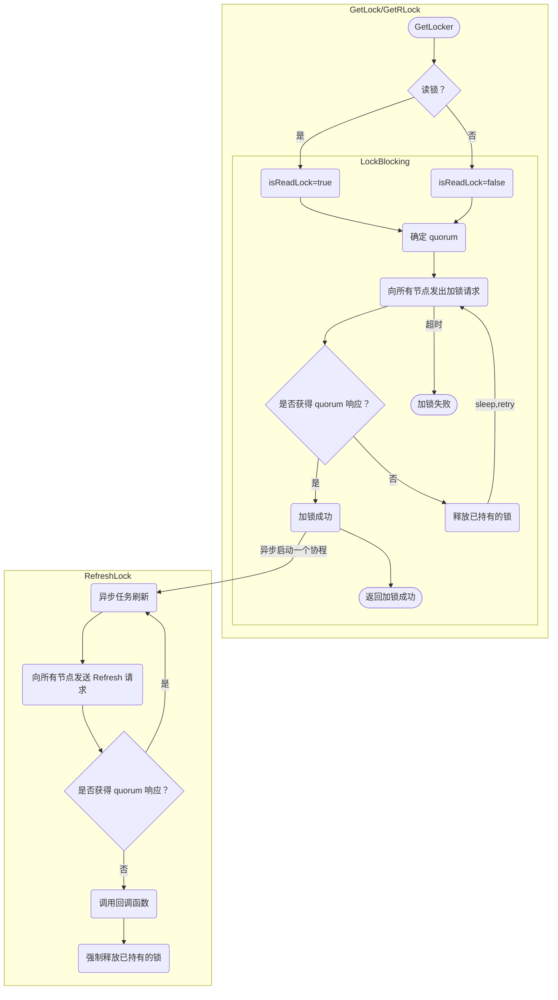

# MinIO 笔记（5）：分布式锁


<!-- more -->

## Dsync

「Dsync」是 MinIO 中的用于实现分布式锁的组件。当一个 Node 需要加锁时，它会向所有 Node（包括自己）发出加锁请求，只有在收到至少 n/2 + 1 个同意的响应之后（对于读锁 n/2），才能成功获取锁。

### 实现
Dsync 组件负责协调多个 Node 之间的锁请求，而 Node 之间的加解锁通信，是通过 NetLocker 接口实现的。

Dsync 的数据结构如下：
```go
// Dsync represents dsync client object which is initialized with
// authenticated clients, used to initiate lock REST calls.
type Dsync struct {
	// List of rest client objects, one per lock server.
	GetLockers func() ([]NetLocker, string)

	// Timeouts to apply.
	Timeouts Timeouts
}
```
`GetLockers` 方法返回 NetLocker 实例列表，用于与所有 Node 进行加解锁通信。

NetLocker 接口定义了分布式锁的基本操作，包括加锁、解锁、刷新锁等。
```go
// NetLocker is dsync compatible locker interface.
type NetLocker interface {
	// Do read lock for given LockArgs.  It should return
	// * a boolean to indicate success/failure of the operation
	// * an error on failure of lock request operation.
	RLock(ctx context.Context, args LockArgs) (bool, error)

	// Do write lock for given LockArgs. It should return
	// * a boolean to indicate success/failure of the operation
	// * an error on failure of lock request operation.
	Lock(ctx context.Context, args LockArgs) (bool, error)

	// Do read unlock for given LockArgs. It should return
	// * a boolean to indicate success/failure of the operation
	// * an error on failure of unlock request operation.
	// Canceling the context will abort the remote call.
	// In that case, the resource may or may not be unlocked.
	RUnlock(ctx context.Context, args LockArgs) (bool, error)

	// Do write unlock for given LockArgs. It should return
	// * a boolean to indicate success/failure of the operation
	// * an error on failure of unlock request operation.
	// Canceling the context will abort the remote call.
	// In that case, the resource may or may not be unlocked.
	Unlock(ctx context.Context, args LockArgs) (bool, error)

	// Refresh the given lock to prevent it from becoming stale
	Refresh(ctx context.Context, args LockArgs) (bool, error)

	// Unlock (read/write) forcefully for given LockArgs. It should return
	// * a boolean to indicate success/failure of the operation
	// * an error on failure of unlock request operation.
	ForceUnlock(ctx context.Context, args LockArgs) (bool, error)

	// Returns underlying endpoint of this lock client instance.
	String() string

	// Close closes any underlying connection to the service endpoint
	Close() error

	// Is the underlying connection online? (is always true for any local lockers)
	IsOnline() bool

	// Is the underlying locker local to this server?
	IsLocal() bool
}
```

NetLocker 通过 RPC 调用，向其他节点发送加锁、解锁、刷新等请求。请求的结构体如下，包括加锁的对象、锁的持有者、需要的 quorum 节点数等。
```go
type LockArgs struct {
	// Unique ID of lock/unlock request.
	UID string

	// Resources contains single or multiple entries to be locked/unlocked.
	Resources []string

	// Owner represents unique ID for this instance, an owner who originally requested
	// the locked resource, useful primarily in figuring out stale locks.
	Owner string

	// Source contains the line number, function and file name of the code
	// on the client node that requested the lock.
	Source string `msgp:"omitempty"`

	// Quorum represents the expected quorum for this lock type.
	Quorum *int `msgp:"omitempty"`
}
```

### 加锁
加锁的基本步骤为,阻塞的尝试向所有节点获取锁

- 获取 quorum 节点的响应，则加锁成功，启动一个异步任务去定时刷新锁。刷新锁的基本步骤为：
    * 向所有节点发送 Refresh 请求
    * 获取 quorum 节点的响应，则刷新成功
    * 否则，调用回调函数，强制释放已持有的锁
- 未获取则重试至超时




### 释放锁
释放锁的基本步骤为：

- 向所有节点发送 Unlock 请求
- 获取 quorum 节点的响应，则释放锁成功
- 失败则退避重试，直至成功或超时

## NetLocker 实现
上述的 Dsync 组件负责在多个 Node 之间协调锁请求；对 Node 的加锁、解锁、刷新等操作由 NetLocker 实现。

NetLocker 采用之前的 Grid 通信框架，将 NetLocker 的服务接口注册到 Grid 的 Handler 中，以实现节点间的 RPC 调用。

NetLocker 的一个实现是 `localLocker` 实现，`localLocker` 接受 Node 间的加解锁请求，在本地 Node 上维护锁的状态。

## 不同的锁实现

在 MinIO 中，通过上述的 Dsync 分布式锁机制，实现了两种类型的锁：

- Namespace Lock：
- Shard Lock：