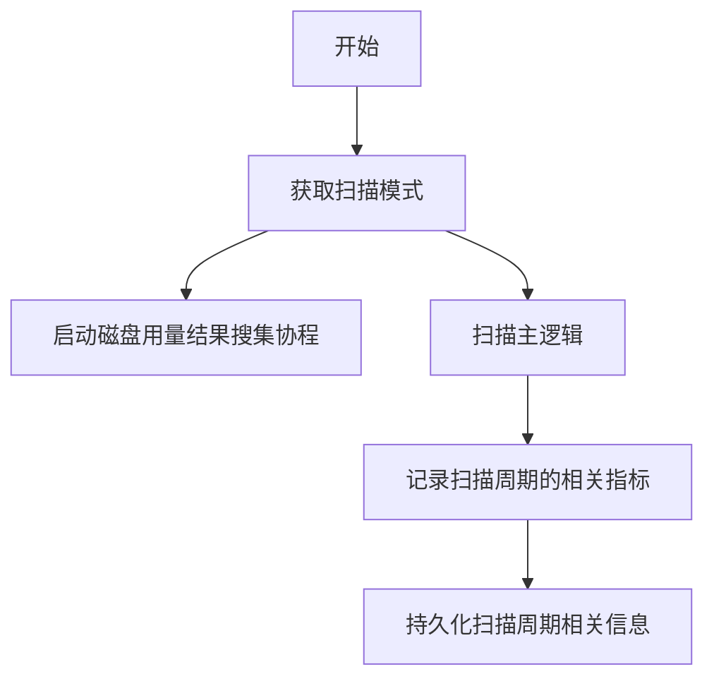
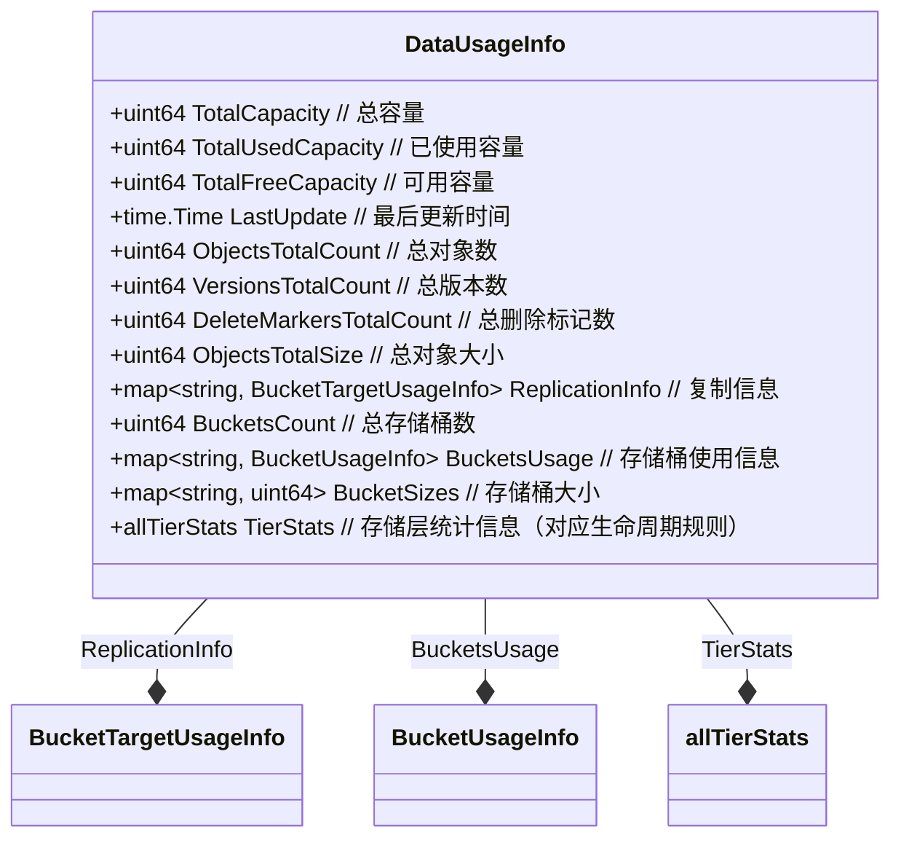
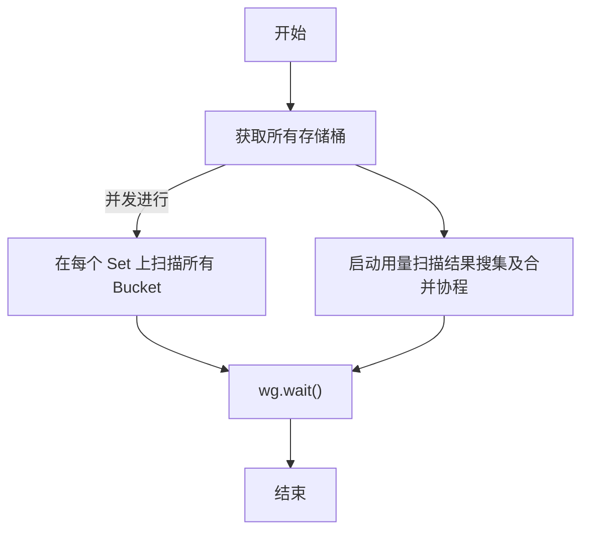
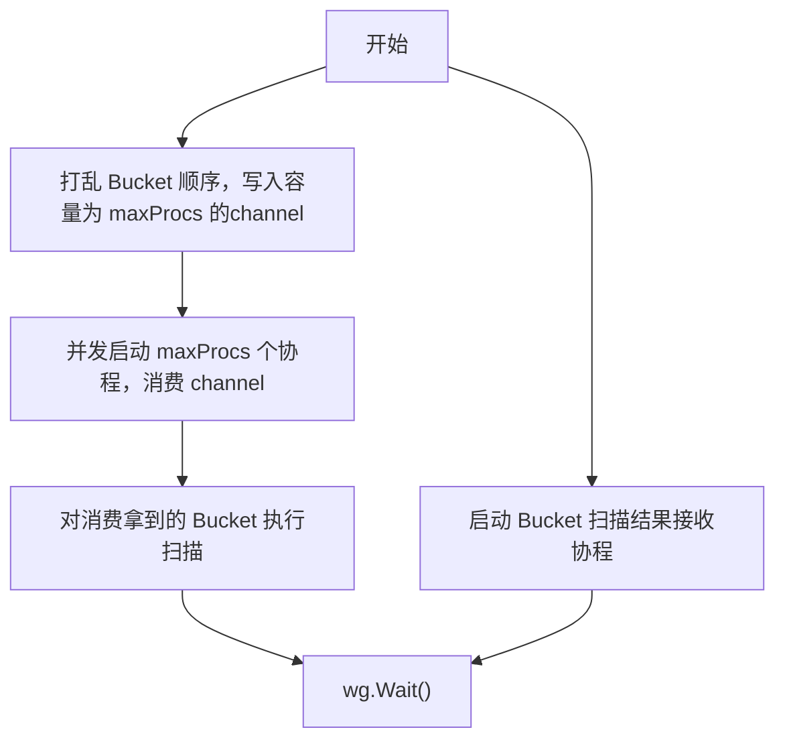
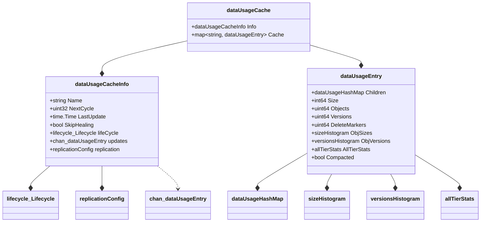
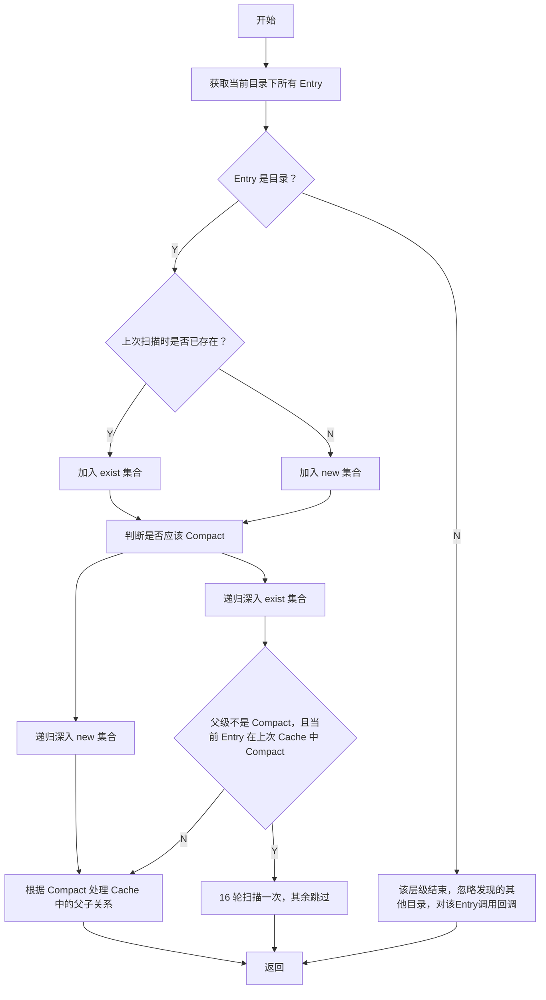

# MinIO 笔记（9）：对象扫描


<!-- more -->

MinIO 中的数据扫描模块（Scanner）用来定期扫描对象来执行修复以及其他操作，包括：

- 统计磁盘使用量。
- 应用 ILM 规则。
- 执行存储桶或站点复制。
- 检查对象是否损坏，执行修复。

## Scanner 子系统

### 主流程
MinIO 启动时会启动一个启动 `initDataScanner` 的协程，用于尝试获取 Scanner 的执行权。`runDataScanner` 函数通过全局的 Leader 锁（一个 shared lock）来确保集群内只有一个 Scanner 实例在运行。当目前的 Scanner 所在实例丢失 Leader 之后，`runDataScanner` 函数会退出，集群开始通过抢锁的方式来获取 Scanner 的执行权。

```go
// initDataScanner will start the scanner in the background.
func initDataScanner(ctx context.Context, objAPI ObjectLayer) {
	go func() {
		r := rand.New(rand.NewSource(time.Now().UnixNano()))
		// Run the data scanner in a loop
		for {
			runDataScanner(ctx, objAPI)
			duration := time.Duration(r.Float64() * float64(scannerCycle.Load()))
			if duration < time.Second {
				// Make sure to sleep at least a second to avoid high CPU ticks.
				duration = time.Second
			}
			time.Sleep(duration)
		}
	}()
}
```

`runDataScanner` 抢到全局锁之后，会启动一个循环，每次循环的主逻辑为：


其中扫描模式是针对对象修复时的检查方式的，包括：

- HealNormalScan：正常扫描模式，会检查对象是否丢失获取过期。
- HealDeepScan：深度扫描模式，会检查 bitrot 错误。

默认情况下，Scanner 不会启用 DeepScan 模式，可以通过环境变量 `MINIO_HEAL_BITROTSCAN` 或 `heal bitrotscan` 配置项来配置，值为：

- 0：HealDeepScan 模式。
- -1：HealNormalScan 模式（默认）。
- [x]m：启用 DeepScan 模式，且扫描时间间隔为 x 月，不能小于 1 个月一次。

当启用了定期使用 DeepScan 时，为了保证每个 Object 都会被检查到，当定期时间到了之后会连续以 1024 次 DeepScan 模式进行扫描，这个数值与后面 Object 被选择进行修复操作的周期相关。

### 磁盘用量结果搜集
该部分会启动一个协程，读取扫描主流程输出的结果，将结果持久化到 `.minio.sys/buckets/.usage.json` 对象中。具体的内容包括如下一些统计信息：



### 扫描主逻辑
在整个集群层面：

在每一个 ErasureSet 层面，会根据扫描的并发数将所有 Bucket 进行分组进行扫描。并发度计算如下：
```go
// Restrict parallelism for disk usage scanner
// upto GOMAXPROCS if GOMAXPROCS is < len(disks)
maxProcs := runtime.GOMAXPROCS(0)
if maxProcs < len(disks) {
  disks = disks[:maxProcs]
}
```
主要流程如下：


针对每个 Bucket 的扫描入口 API 为由 `StorageAPI` 提供的：
```go
NSScanner(ctx context.Context, cache dataUsageCache, updates chan<- dataUsageEntry, scanMode madmin.HealScanMode, shouldSleep func() bool) (dataUsageCache, error)
```
核心实现是通过 `scanDataFolder` 方法，扫描 Bucket 下的对象，并注册一个回调，回调函数内部实现修复、生命周期规则检查等功能。每次扫描并不会把每个对象都扫描到，有一些 skip 的逻辑。下面详细介绍 `scanDataFolder` 的实现。

首先从看贯穿整个扫描过程的 `dataUsageCache` 结构体，该结构体包含了一个 Bucket 下的所有用量统计信息，持久化在 `.minio.sys/buckets/<bucket-name>/..usage-cache.bin` 对象中，包含以下数据：


Cache 是一个以 Bucket 目录为根的树形结构，通过 Map 扁平化，所有的 Node 都在 Cache 这个 Map 中，每个 Entry 维护自己的 Children 。树的叶子不一定是一个对象，而可能是其下所有对象的统计信息合并后的结果。

整个扫描过程是一个深度优先遍历，在每一层级，基本流程为：

Compact 会发生在：

- 目录（包含子目录）下包含少于 `dataScannerCompactLeastObject`（500） 个 Object
- 目录（非 Bucket 层级）包含至少 `dataScannerCompactAtFolders`（2500） 个子目录。
- 目录只包含 `Object`（完整的 Object 目录，不是指 xl.meta 那一层）没有其他子目录。
- 目录（包含 Bucket 目录）下包含超过 `dataScannerForceCompactAtFolders` （250_000）个子目录。

### ScanItem 操作
上述扫描主逻辑的递归基是发现一个 xl.meta 文件，即一个 ScanItem。在 Scanner 入口处，对每一个 ScanItem 会注册一个回调，回调内部处理各种操作，包括：

- 修复对象
- 生命周期规则
- 副本操作

对于修复、副本操作：依据 Item 是否被选中，决定是否进行修复操作，每个 Object 会在 1024 次扫描中修复一次。

对于生命周期规则的运用：会根据规则进行匹配计算，生成对应的动作，由于扫描 Compact 和 Skip 的机制存在，每个 Object 至少会在 16 轮扫描中被扫描到。