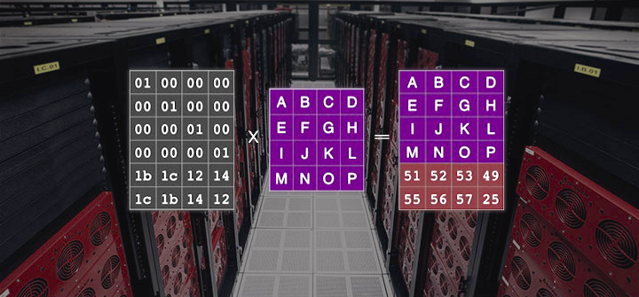
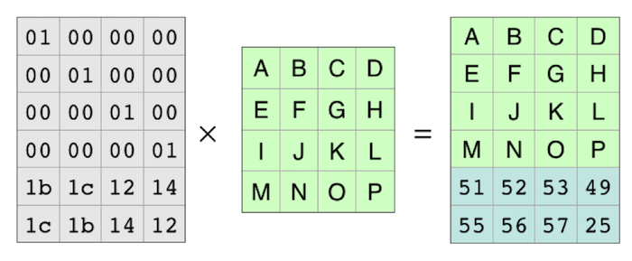
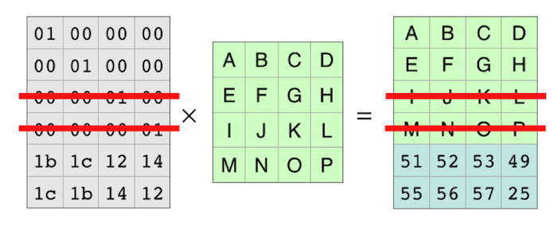
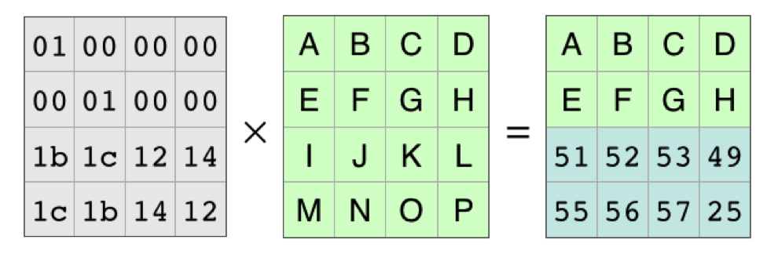
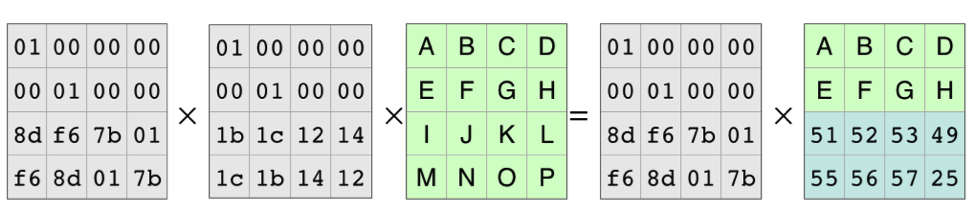
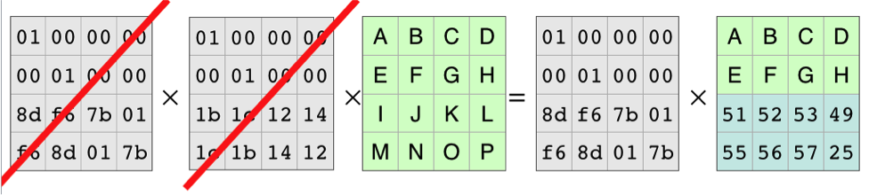
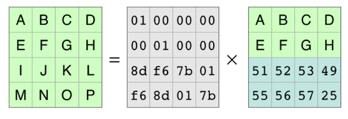

# Reed-Solomon 算法简介

EC 编码是一种数据冗余编码技术，用于在数据传输过程中增加冗余数据，以提高数据的可靠性和容错性。EC 编码将数据分为 K 个数据块和 M 个校验块，其中 K+M 等于数据块总数。最多可以容忍 M 个数据块的丢失。

<!-- more -->

## 基本原理

以下图的数据为例，通过 EC:2 编码，进行 EC 编码。

{ width="200" }
///caption
///

首先，上述原数据被分为 4 个数据块，对应图中的一行，EC 编码会创建一个编码矩阵与原数据分片相乘:

{ width="700" }
///caption
///

得到的结果矩阵比原数据多两行，对应两个校验分片。

我们模拟数据丢失，划掉其中两行：

{ width="750" }
///caption
///

由于矩阵每行相互独立，我们可以得到如下等式：

{ width="700" }
///caption
///

由于编码矩阵可逆，我们构造编码矩阵的逆矩阵，等式两边分别乘逆矩阵：

{ width="800" }
///caption
///

矩阵和其逆矩阵相乘等于单位矩阵，即：

{ width="800" }
///caption
///

最终得到：

{ width="750" }
///caption
///

如此便得到恢复后的原数据。

## 参考

- [reed-solomon 算法介绍]https://www.backblaze.com/blog/reed-solomon/