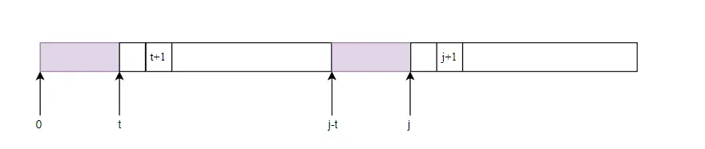
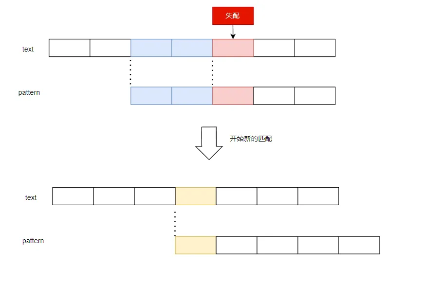
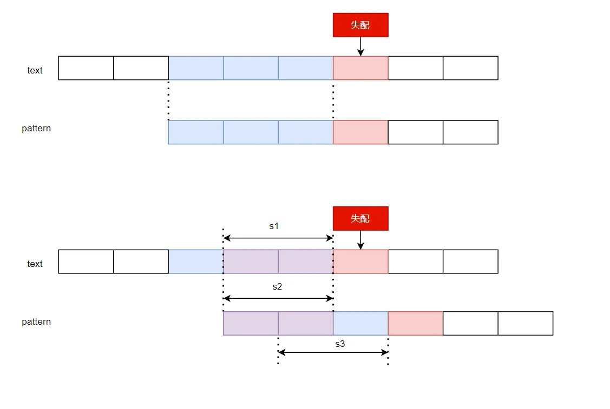
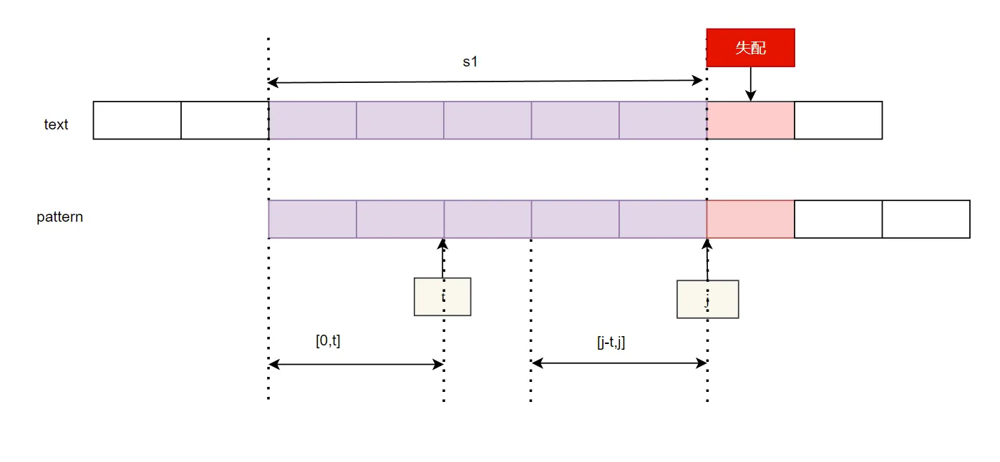
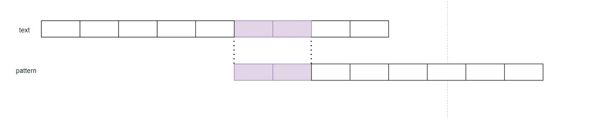

# String

<!-- more -->

## 串匹配算法
### 暴力解法
每次产生失配之后，仅将文本串后移一位，然后开始新一轮的比对。

```cpp
int Match(const std::string& text, const std::string& pattern) {
	int m = text.size();
	int n = pattern.size();

	int i = 0;
	int j = 0;

	while (i < m&&j < n) {
		if (text[i] == pattern[j]) {
			++i;
			++j;
		} else {
			j = 0;
			i -= (j - 1);
		}
	}
	return i - j;
}
```

i-j的值可以简明的指出是否匹配成功，及匹配成功的子串在text串中的位置。



### KMP算法

1.改进的可能性

由上面的暴力解法可以发现，每次移动一格从头开始匹配过于保守，根据已获得的信息，可以避免这种不必要的匹配。



假设如此移一格的方法是可行的，那么一定有下式成立：
s1==s2==s3
s2与s3由模式串本身决定，s1=s3是前提条件，因此，将问题一般化可以得出：
在上一步匹配的情况下，若模式串中存在下图中的特征：



即：
        $pattern[0,t)==pattern[j- t,j)$
有上述对应关系，则当匹配过程在pattern[j]处失配时，可不必只将文本串前移一位进行匹配，而是直接前移j-t进行匹配，并忽略[0,t)因为它们一定是匹配的。
如下，紫色区段一定是匹配的，这是由上一次匹配成功和模式串本身特征决定的：



2.引入next[]表

所幸，以上的信息在模式串pattern中完全可以获得。即，对于每一个pattern串中的j，都找到一个t使得[0,t)==[j - t,j)，如果存在多个t满足，则取t最大者，其中原因为：若取小者，则意味着在匹配失配后移动时，pattern串向右移动的更大，而此前存在一个大者的t（移动的更小）也可能匹配成功，故取小者会带来回溯的问题。



将上面的t值制表待查，即得到了next[]表。

3.next[]表的计算

对于next表，采取递推的方式计算。在next[]表中必然有：
$next[j+1]<=next[j]+1；  当且仅当p[t] = p[j]时，取等号。$
等号条件很好取得，为何小于？若不小于则与next[j]是所有候选的t中最大的那个相矛盾。
当p[t] != p[j]时，则为寻找到一个t，使得p[t] = p[j];只需令t = next[t];即向前找一个更短的匹配前缀。


```cpp
int* getNext(string needle){
    int* next = new int[needle.size()];
    int j = 0;
    next[j] = -1;
    int t =next[j];
    while(j<needle.size()-1){
        if(t<0||needle[j] == needle[t]){
            next[++j] = ++t;
        }
        else{
            t = next[t];
        }
    }
    return next;
}
```

哨兵节点的设置：next[0]设置为-1；需要用到next[0]的情况，即pattern串在j = 0处失配。如下图，设置哨兵pattern[-1]与任何字符通配，则可令算法统一且不致出错。


匹配算法：
```cpp
int strStr(string haystack, string needle) {
    if(needle.size() == 0){
        return 0;
    }
    int* next = getNext(needle);
    int i = 0;
    int j = 0;
    int m = haystack.size();
    int n = needle.size();
    while(i<m&&j<n){
        // 匹配，向前
        if(j<0||haystack[i]==needle[j]){
            ++i;
            ++j;
        }
        else{
            // 失配，找到等效前缀，继续尝试匹配
            j = next[j];
        }
        if(j == n){
            delete[] next;
            return i - j;
        }
    }
    delete[] next;
    return -1;
}
```

4.next[]表再改进
next表记录了j位置之前已匹配成功的子串信息并利用了这一信息，但是在上一次失败的匹配中还有一个失败与j处的信息没有被利用，（成功匹配称为经验，失败匹配称为教训），上一版本的next表只利用了经验，未利用教训。教训所表达的含义为：在j处的字符失败匹配了，故t指定的位置除了[0,t)匹配j之前的某一子串，还要至少p[t]!=p[j]，以规避现有的失败教训。

```cpp
int* next(const std::string& pattern) {
	int* next = new int[pattern.size()];
	int m = pattern.size();
	next[0] = -1;
	int t = next[0];
	int i = 0;
	while (i < m - 1) {
        //由i递堆得到i+1
		if (t < 0 || pattern[i] == pattern[t]) {
			if(pattern[i+1] == pattern[t+1]) {
				//失配处将再次失配，故跳过这一不必要的匹配，找到一个不等的出来
				//从前往后递推，保证了next[t+1]一定不等
				next[i+1] = next[t+1];//t+1<i+1恒成立，故next[t+1]一定已赋值
			} else {
				next[i+1] = t + 1;
			}
			++i;
			++t;
		} else {
			t = next[t];
		}
	}
	return next;
}
```

### BM算法

改变匹配策略，以终为始。