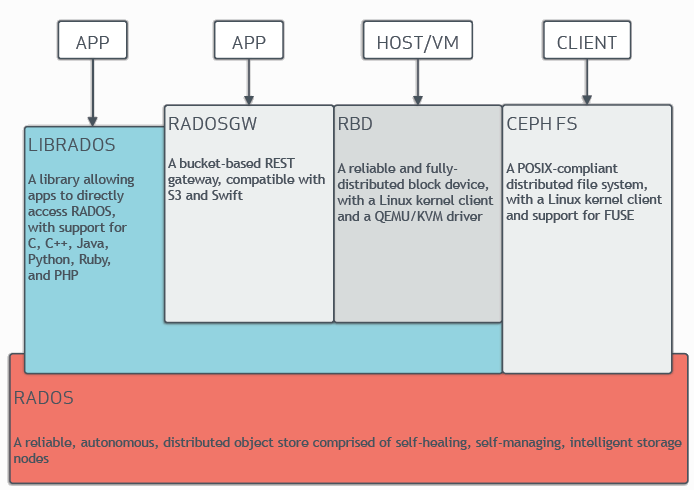
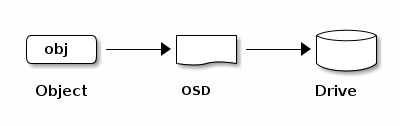
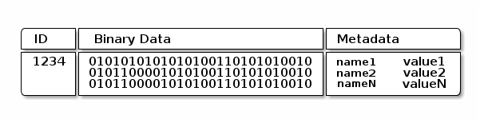
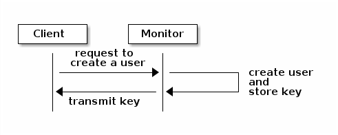
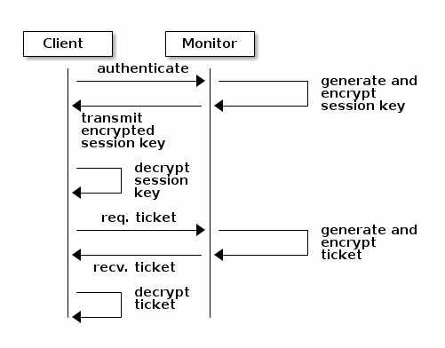
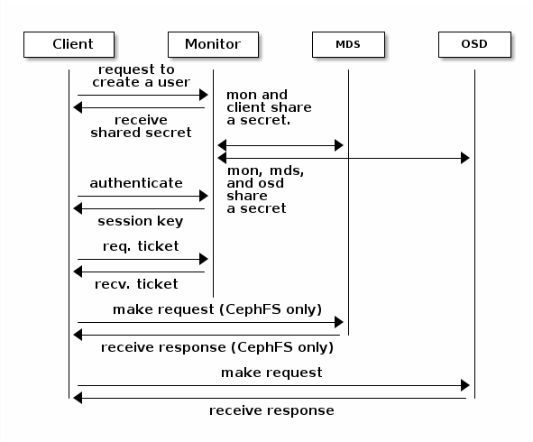
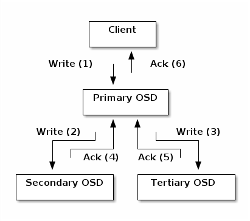

# CEPH架构

[Ceph](https://docs.ceph.com/en/reef/glossary/#term-Ceph)是一个提供 **对象、块和文件存储** 的统一系统，它高度可靠、易于管理且免费。Ceph 提供了强大的可扩展性 - 支持数千个客户端访问 PB 到 EB 量级的数据。[Ceph 节点](https://docs.ceph.com/en/reef/glossary/#term-Ceph-Node) 通过智能守护进程充分利用商用硬件设备， [Ceph 存储集群](https://docs.ceph.com/en/reef/glossary/#term-Ceph-Storage-Cluster)可容纳大量节点，这些节点可以相互直接通信以实现数据的动态复制以及重新分发。

<!-- more -->

## CEPH 集群

Ceph 提供基于 RADOS 的无限可扩展 [存储集群](https://docs.ceph.com/en/reef/glossary/#term-Ceph-Storage-Cluster)，RADOS 是一种可靠的分布式存储服务，它使用每个存储节点中的智能守护进程来保护其存储的数据，并将该数据提供给[客户端](https://docs.ceph.com/en/reef/glossary/#term-Client)。有关 RADOS 的简要说明，请参阅 Sage Weil 的“[RADOS 对象存储](https://ceph.io/en/news/blog/2009/the-rados-distributed-object-store/)”博客文章，参阅[ RADOS - 适用于 PB 级存储集群的可扩展、可靠的存储服务](https://ceph.io/assets/pdfs/weil-rados-pdsw07.pdf)，了解有关 [RADOS](https://docs.ceph.com/en/reef/glossary/#term-RADOS) 的详尽说明。

Ceph 存储集群由多种类型的守护进程组成：

- Ceph Monitor
- Ceph OSD 守护进程
- Ceph Manager
- Ceph Metadata Server

Monitor维护集群映射的主副本，并将其提供给 Ceph 客户端。Ceph 集群中存在多个 Monitor可确保在其中一个 Monitor 守护进程或其主机发生故障时的可用性。

Ceph OSD 守护进程检查自己的状态和其他 OSD 的状态，并向 Monitor 报告。

Ceph Manager 用作监控、编排和插件模块的终端节点。

当 CephFS 用于提供文件服务时，Ceph 元数据服务器 （MDS） 会管理文件元数据。

存储集群客户端和 [Ceph OSD 守护程序](https://docs.ceph.com/en/reef/glossary/#term-Ceph-OSD-Daemon)使用 CRUSH 算法来计算有关数据位置的信息。使用 CRUSH 算法意味着客户端和 OSD 不会受到中心化查找表的瓶颈。Ceph 的高级功能包括通过 `librados` 连接到 Ceph 存储集群的原生接口，以及基于 `librados` 构建的许多服务接口。

## 存储数据

Ceph 存储集群从[ 客户端](https://docs.ceph.com/en/reef/glossary/#term-Ceph-Client) 接收数据，无论是通过 [Ceph 块设备](https://docs.ceph.com/en/reef/glossary/#term-Ceph-Block-Device)、[Ceph 对象存储](https://docs.ceph.com/en/reef/glossary/#term-Ceph-Object-Storage)、[Ceph 文件系统](https://docs.ceph.com/en/reef/glossary/#term-Ceph-File-System)，还是使用 `librados` 创建的自定义实现的客户端，Ceph 都会将接收的数据存储为 RADOS 对象。每个对象都存储在[对象存储设备](https://docs.ceph.com/en/reef/glossary/#term-Object-Storage-Device)（也称为“OSD”）上。OSD 控制存储驱动器上的读取、写入和复制操作。默认使用 BlueStore 存储后端，以一种类似于数据库的方式存储对象。

OSD 守护进程将数据作为对象存储在平面命名空间中，这意味着在 OSD 上不存储在目录层次结构。对象由标识符、二进制数据和由名称/值对组成的元数据构成。[Ceph 客户端](https://docs.ceph.com/en/reef/glossary/#term-Ceph-Client)确定对象数据的语义。例如，CephFS 使用元数据来存储文件属性，例如文件所有者、创建日期和上次修改日期。

!!! note

    对象 ID 在整个集群中是唯一的，而不仅仅是在本地文件系统统

## 可扩展性和高可用性

在传统架构中，客户端与一个中心化的组件通信。这个中心化的组件可以是网关、代理、API 或 Facade。此类中心化的组件充当复杂子系统的单一入口点，依赖于这种集中式组件的架构具有单点故障，并会导致性能和可扩展性受到限制。如果集中式组件宕机，则整个系统将不可用。

Ceph 从设计之初就避免了这种单点的限制，它使客户端可以直接与 Ceph OSD 交互，Ceph OSD 彼此之间互相通信进行对象的副本创建，以确保数据安全和可用性。此外，Ceph 通过 Mon 集群来保证高可用。为了消除中心化，Ceph 使用了一种称为 CRUSH 的算法。

### CRUSH 简介

Ceph 中对象的实际存储位置不是依赖于一个中心化的组件进行查表得到的，而是通过计算得出的。Ceph 客户端和 Ceph OSD 守护进程都是用 CRUSH 算法来计算有关对象存储位置的信息。与传统方式相比，CRUSH 算法提供了更好的数据管理机制，并且 CRUSH 算法通过将工作分配给集群中所有的 OSD 以及与之通信的客户端来实现大规模的扩展。CRUSH 使用智能数据复制来确保弹性，这更适合超大规模存储。以下部分提供了有关 CRUSH 工作原理的更多详细信息。有关 CRUSH 的深入学术讨论，请参阅 [CRUSH - 复制数据的受控、可扩展、去中心化放置](https://ceph.io/assets/pdfs/weil-crush-sc06.pdf)。

### 集群映射

为了使 Ceph 集群正常运行，Ceph 客户端和 Ceph OSD 必须具有有关集群拓扑的最新信息。当前信息存储在 “Cluster Map” 中，它实际上是五个映射的集合。构成集群映射的 5 个映射是：

1. **Monitor 映射** :包含每个监视器的集群 `fsid`、位置、名称、地址和 TCP 端口。监控映射指定当前纪元、监控映射的创建时间以及监控映射的上次修改时间。要查看监控映射，请运行 `ceph mon dump`。
2. **OSD 映射** :包含群集 `fsid`、OSD 映射的创建时间、OSD 映射的上次修改时间、池列表、副本大小列表、PG 编号列表以及 OSD 及其状态（例如，`up`、`in`）的列表。要查看 OSD 映射，请运行 `ceph osd dump`。
3. **PG 映射** :包含 PG 版本、其时间戳、最后一个 OSD 映射纪元、完整比率以及每个置放群组的详细信息。这包括 PG ID、Up Set、Acting Set、PG 的状态（例如，`active + clean`）以及每个池的数据使用统计信息。
4. **CRUSH 映射** :包含存储设备列表、故障域层次结构（例如，`设备`、`主机`、`机架`、`行`、`房间`）以及在存储数据时遍历层次结构的规则。要查看 CRUSH 索引，请运行 `ceph osd getcrushmap -o {filename}` 它，然后通过运行 `crushtool -d {comp-crushmap-filename} -o {decomp-crushmap-filename}` .使用文本编辑器或 `cat` 查看反编译的映射。
5. **MDS 映射** :包含当前 MDS 映射纪元、映射的创建时间以及上次更改的时间。它还包含用于存储元数据的池、元数据服务器列表以及`已启动`和`加入`的元数据服务器。要查看 MDS 映射，请执行 `ceph fs dump`。

每个映射都维护其运行状态更改的历史记录。Ceph Mon 维护集群映射的主副本。此主副本包括集群成员、集群状态、集群更改以及记录 Ceph Storage 集群整体运行状况的信息。

### 高可用 Monitor

Ceph 客户端必须联系 Ceph Monitor 并获取集群映射的当前副本，才能从 Ceph 集群读取数据或将数据写入 Ceph 集群。

Ceph 集群可以只使用单个 Monitor 正常运行，但只有一个 Monitor 的 Ceph 集群存在单点故障：如果 Monitor 宕机，Ceph 客户端将无法从集群读取数据或向集群写入数据。

Ceph 利用监控器集群来提高可靠性和容错能力。但是，当使用监视器集群时，集群中的一个或多个监视器可能会因延迟或其他故障而滞后。Ceph 通过要求多个 monitor 实例就集群的状态达成一致来减轻这些负面影响。为了在 Monitor 之间就集群的状态达成共识，Ceph 使用 [Paxos](<https://en.wikipedia.org/wiki/Paxos_(computer_science)>) 算法和大多数 Monitor（例如，一个在仅包含一个 monitor 的集群中，两个在包含 3 个 Monitor 的集群中，三个在包含 5 个 Monitor 的集群中，四个在包含 6 个 Monitor 的集群中， 等等）。

有关配置 Monitor 的更多详细信息，请参阅 [Monitor Config Reference](https://docs.ceph.com/en/latest/rados/configuration/mon-config-ref)。

### 高可用身份验证

Ceph 使用 `cephx` 身份验证系统对用户和守护进程进行身份验证，并防止中间人攻击。

!!! note

    `cephx` 协议不处理传输中的数据加密（例如 SSL/TLS）或静态加密。

`Cephx` 使用共享密钥进行身份验证。这意味着客户端和 Monitor 集群都保留客户端密钥的副本。

`cephx` 协议使每一方都可以在不泄露密钥的情况下向另一方证明它拥有密钥的副本。这提供了相互身份验证，并允许集群确认 （1） 用户拥有密钥，以及 （2） 用户可以确信集群拥有密钥的副本。

如[可扩展性和高可用性](#MO5p1)中所述，Ceph 在客户端和 Ceph 对象存储之间没有任何中心化的接口。得益于此，Ceph 避免了此类中心化的接口带来的瓶颈。但是，这意味着客户端必须直接与 OSD 交互。Ceph 客户端和 OSD 之间的直接交互需要经过身份验证的连接。`cephx` 身份验证系统建立并维护这些经过身份验证的连接。

`cephx` 协议的运行方式类似于 [Kerberos](<https://en.wikipedia.org/wiki/Kerberos_(protocol)>)。

用户调用 Ceph 客户端来联系 Monitor。与 Kerberos 不同，每个 Monitor 都可以对用户进行身份验证并分发密钥，这意味着在使用 `cephx` 时没有单点故障，也没有瓶颈。Monitor 返回类似于 Kerberos 票证的身份验证数据结构。此身份验证数据结构包含用于获取 Ceph 服务的会话密钥。会话密钥本身使用用户的永久密钥进行加密，这意味着只有用户才能从 Monitor 请求服务。然后，客户端使用会话密钥向 Monitor 请求服务，Monitor 向客户端提供一个票证，该票证根据实际处理数据的 OSD 对客户端进行身份验证。Monitor 和 OSD 共享一个密钥，这意味着客户端可以使用 Monitor 提供的票据对集群中的任何 OSD 或 MDS 服务器进行身份验证。

与 Kerberos 票证一样，`cephx` 票证也会过期。攻击者无法使用已过期的票证或秘密获取的会话密钥。这种形式的身份验证可以防止有权访问通信介质的攻击者以其他用户的身份创建虚假消息，并防止攻击者更改其他用户的合法消息，只要用户的密钥在过期之前没有泄露。

管理员必须在使用 `cephx` 之前设置用户。在下图中，`client.admin` 用户从命令行调用 `ceph auth get-or-create-key` 以生成用户名和密码。Ceph 的`auth`子系统生成用户名和密钥，在 Monitor 上存储副本，并将用户的密钥传输回 `client.admin` 用户。这意味着客户端和 Monitor 共享一个密钥。

!!! note

    `client.admin` 用户必须以安全的方式向用户提供用户 ID 和密钥。

以下是客户端使用 Monitor 进行身份验证的方式。客户端将用户名传递给 Monitor。Monitor 会生成一个会话密钥，该密钥使用与`username`关联的密钥进行加密。Monitor 将加密的票证传输到客户端。客户端使用共享密钥解密有效负载。会话密钥标识用户，此标识行为将持续整个会话持续时间。客户端为用户请求票证，并使用会话密钥对票证进行签名。Monitor 生成一个票证，并使用用户的密钥对其进行加密。加密的票证将传输到客户端。客户端解密票证，并使用它对集群中的 OSD 和元数据服务器发出请求进行签名。

`cephx` 协议验证客户端和 Ceph 守护进程之间的持续通信。初始身份验证后，客户端和守护程序之间发送的每条消息都使用票证进行签名，该票证可由 Monitor、OSD 和元数据守护程序验证。此票证使用客户端和守护程序之间共享的密钥进行验证。

此身份验证仅保护 Ceph 客户端和 Ceph 守护进程之间的连接。身份验证不会扩展到 Ceph 客户端之外。如果用户从远程主机访问 Ceph 客户端，则 cephx 身份验证将不会应用于用户的主机与客户端主机之间的连接。

有关配置详细信息的更多信息，请参阅 [Cephx Config 指南](https://docs.ceph.com/en/latest/rados/configuration/auth-config-ref)。

有关用户管理的更多信息，请参阅[用户管理](https://docs.ceph.com/en/latest/rados/operations/user-management).

有关授权和身份验证之间区别的更多信息，以及 `cephx` 票据和会话密钥设置的分步说明，请参阅 [Cephx 身份验证协议的详细说明](https://docs.ceph.com/en/latest/dev/cephx_protocol/#cephx-2012-peter)

### 智能守护进程支撑超大规模

许多存储集群的一个特点是使用中心化的接口，来跟踪允许客户端访问的节点。这种集中式架构通过双重调度的方式向客户端提供服务。在 PB 到 EB 的规模上，这种双重调度是一个重大瓶颈。

Ceph 使 OSD 守护进程和客户端都可以感知集群，从而消除了这一瓶颈问题。与 Ceph 客户端一样，每个 OSD 守护进程都知道集群中的其他 OSD 守护进程，因此它们之间可以互相通信，并直接与 Ceph Monitor 交互。集群感知使客户端能够直接与 OSD 守护进程交互。

由于 Ceph 客户端、Monitor 和 OSD 守护进程可以直接相互通信，这意味着 OSD 可以利用本地节点的 CPU 和内存执行那些有可能拖垮中央服务器的任务。从而更有效的利用了集群的计算能力，这种设计提供了几个好处：

1. **OSD 直接服务于客户端** :由于任何网络设备都有最大并发连接上限， 规模巨大时中央化的系统其物理局限性就暴露了。 Ceph 允许客户端直接和 OSD 节点联系， 这在消除单故障点的同时， 提升了性能和系统总容量。 Ceph 客户端可按需维护和某 OSD 的会话， 而不是一中央服务器。
2. **OSD 成员和状态** :Ceph OSD 加入集群后会持续报告自己的状态。 在底层， OSD 状态为 `up` 或 `down` ， 反映它是否在运行、能否提供服务。 如果一 OSD 状态为 `down` 且 `in` ， 表明 OSD 守护进程可能失败了； 如果一 OSD 守护进程没在运行（比如崩溃了）， 它就不能亲自向监视器报告自己是 `down` 的。 所有 OSD 都会周期性地向 Ceph 监视器发送消息 （ luminous 之前是 `MPGStats` ， luminous 起新增 `MOSDBeacon` ）； 如果 Ceph 监视器在配置的周期内没看到这消息，就把它标记为 `down` ， 然而，这只是个故障双保险机制。正常情况下， Ceph OSD 守护进程会判断邻居 OSD 是否倒下、并报告给监视器（们）。 这样就能保证 Ceph 监视器始终是个轻量级进程。详情请参阅[监控 OSD](https://docs.ceph.com/en/reef/rados/operations/monitoring-osd-pg/#monitoring-osds) 和[心跳](https://docs.ceph.com/en/reef/rados/configuration/mon-osd-interaction)。
3. **数据清理** :为了保持数据一致性，OSD 守护进程会清理 RADOS 对象。OSD 将其本地对象的元数据与存储在其他 OSD 上的副本的元数据进行比较。数据清理按 PG 组进行，比较对象大小与元数据，并且通常每天执行一次。OSD 守护进程通过将对象中的数据逐位与其校验和进行比较来执行更深入的清理。深度清理会在驱动器上发现使用轻度清理无法检测到的坏扇区。有关配置清理的详细信息，请参阅[**数据清理**](https://docs.ceph.com/en/reef/rados/configuration/osd-config-ref#scrubbing)。
4. **数据副本** :和 Ceph 客户端一样， OSD 也用 CRUSH 算法， 但用于计算副本存到哪里（也用于重均衡）。 一个典型的情形是， 一客户端用 CRUSH 算法算出对象应存到哪里， 并把对象映射到存储池和归置组， 然后查找 CRUSH 图来确定此归置组的主 OSD 。

客户端把对象写入目标 PG 组的主 OSD ， 然后这个主 OSD 再用它的 CRUSH 图副本找出用于放对象副本的第二、第三个 OSD ， 并把数据复制到适当的 PG 组所对应的第二、第三 OSD （要多少副本就有多少 OSD ）， 最终，确认数据成功存储后反馈给客户端。

## 动态集群管理

在[可扩展性和高可用性](#MO5p1)部分中，我们介绍了 Ceph 如何使用 CRUSH、集群拓扑和智能守护进程来扩展和维护高可用性。Ceph 的核心设计是自治、自愈和智能的 Ceph OSD 守护进程。让我们更深入地了解一下 CRUSH 如何使现代云存储基础设施能够放置数据、重新平衡集群、自适应地放置和平衡数据以及从故障中恢复。

### 存储池

Ceph 存储系统支持存储“池”的概念，即用于存储对象的逻辑分区。  
Ceph 客户端从 Ceph Monitor 检索[集群映射](#M1vDt)，并将 RADOS 对象写入存储池。Ceph 将数据放置在池中的方式取决于池`size`或副本数量、CRUSH 规则以及池中的 PG 数量。

存储池至少设置以下参数：

- 对象的所有权/访问权限
- PG 数量
- CRUSH 规则

有关详细信息，请参阅[设置存储池](https://docs.ceph.com/en/reef/rados/operations/pools#set-pool-values)。

### 将 PG 映射到 OSD

每个池都有多个置放群组 （PG）。CRUSH 将 PG 动态映射到 OSD。当 Ceph 客户端存储对象时，CRUSH 会将每个 RADOS 对象映射到一个 PG。

通过将 RADOS 对象映射到 PG ，Ceph 在 OSD 守护进程和客户端之间实现了抽象和间接层。当内部拓扑发生变化时，Ceph 必须能够自适应地增长（或收缩）和重新分发数据。

如果 Ceph 客户端“知道”哪些 OSD 守护进程正在存储哪些对象，则 Ceph 客户 和 OSD 守护进程之间将存在强耦合。但 Ceph 避免了任何此类强耦合。相反，CRUSH 算法将每个 RADOS 对象映射到一个 PG，然后将每个 PG 映射到一个或多个 OSD 守护进程。此“间接层”允许 Ceph 在新的 OSD 守护进程及其底层 OSD 设备上线时动态地重新平衡。下图显示了 CRUSH 算法如何将对象映射到 PG，以及如何将 PG 映射到 OSD。

客户端使用其集群映射副本和 CRUSH 算法来精确计算在读取或写入特定对象时将使用的 OSD。

### 计算 PG ID

当 Ceph 客户端绑定到 Ceph Monitor 时，它会检索最新版本的[集群映射](#M1vDt)。当客户端获取到集群映射的副本时，它就可以知道集群中的所有 Monitor、OSD 和 MDS。**但是，即使获取了最新版本的集群映射的副本，客户端也不知道对象位置的任何信息，存储对象的物理位置信息必须由计算得出而非查表。**

客户端只需要对象 ID 和池的名称即可计算对象位置。Ceph 将数据存储在命名存储池中（例如，“liverpool”）。当客户端存储命名对象（例如，“john”、“paul”、“george”或“ringo”）时，它会使用对象名称、哈希值、池中的 PG 数量和池名称来计算 PG ID。Ceph 客户端使用以下步骤来计算 PG ID。

1. 客户端输入存储池名称和对象 ID（例如：pool = “liverpool” 和 object-id = “john”）
2. Ceph 对对象 ID 进行哈希处理。
3. Ceph 计算哈希值，对 PG 的数量取模（例如：`58`），以获得 PG ID。
4. Ceph 使用存储池名称检索存储池 ID：（例如：“liverpool” = `4`）
5. Ceph 将存储池 ID 附加到 PG ID 前面（例如：`4.58`）。

通过计算得到对象的存储位置，远比通过一个网络会话来查表高效的多。CRUSH 算法使得客户端可以计算存储对象的理论存储位置，然后通过与主 OSD 直接通信来存储或检索对象。

### 互联和子集

根据前文的叙述，OSD 守护进程会通过心跳检查彼此的状态，并定时上报给 Monitor。OSD 守护进程彼此之间的互联，使得 PG 中所有 OSD 中存储的 RADOS 对象及其元数据达成一致的状态。OSD 守护进程会向 Monitor 上报与之互联的 OSD 连接失败消息，这种失败通常是自愈的，但如果持续存在，则需要参考[对等连接故障故障排除](https://docs.ceph.com/en/reef/rados/troubleshooting/troubleshooting-pg#placement-group-down-peering-failure)部分进行解决。

!!! info
    就集群状态达成一致的 PG 不一定拥有当前数据。

Ceph 存储集群要求每个存储对象至少有两副本（`size = 2`），从而保证数据安全。为了实现高可用，Ceph 存储集群应该保证存储对象有两个以上的副本（`size = 3` 以及 `min size = 2`)），以便可以降级运行同时保证数据安全。

!!! warning
    虽然我们在这里说 R2 （使用两个副本进行复制） 是数据安全的最低要求，但建议使用 R3 （使用三个副本进行复制）。在足够长的时间线上，使用 R2 策略存储的数据将丢失。

如[智能守护进程支撑超大规模](#ExWsP)的图表中所述，我们没有专门命名 Ceph OSD 守护程序（例如，`osd.0`、`osd.1` 等），而是将它们称为 Primary、Secondary 等。按照惯例，Primary 是 Acting Set 中的第一个 OSD，而且它负责协调各归置组的互联进程， 所以称之为Primary  OSD。Primary 是给定 PG 中**唯一**接受客户端发起的对象写入的 OSD。

负责 PG 的 OSD 集合称为 _Acting Set_。术语“_Acting Set_”可以指当前负责 PG 的 Ceph OSD 守护进程，也可以指在某个 epoch 之前负责特定 PG 的 Ceph OSD 守护进程。

_Acting Set_ 中的 OSD 守护进程并不总是处于`up`状态，*Acting Set* 中处于`up`状态的 OSD 集合被称为 *Up Set* 。*Up Set*是一个重要的子集，因为当 OSD 发生故障时，Ceph 可以讲 PG 重新映射到其他 OSD 守护进程中。

!!! note
    考虑一个 PG 的*Acting Set*包含 `osd.25`、`osd.32` 和 `osd.61` 三个 OSD。第一个 OSD （`osd.25`） 是 _Primary_。如果该 OSD 失败，则*Secondary* （`osd.32`） 将成为*主 OSD*，并且 `osd.25` 将从 _Up Set_ 中删除。

### 重平衡

当向 Ceph 集群添加新的 OSD 时，[集群映射](#M1vDt)会被更新。根据[计算 PG ID](#Pv1tA)中所述，集群映射发生变化后，由于对象的实际存储位置是通过计算得出的，且集群映射是该计算过程的一个输入条件，自然这个变化会导致对象的存储位置发生变化。下图描述了 OSD 重平衡的过程（尽管相当粗略，因为在大型集群中，加入一个 OSD 的影响要小的多），其中部分受影响的 PG 从现有的 OSD（OSD 1 和 OSD 2）迁移到新的 OSD（OSD 3）。即使在重平衡之后，CRUSH 也很稳定，许多 PG 仍然保持其原本的配置，而且每个 OSD 都会获得额外的容量（部分 PG 被迁出到新的 OSD 上，因此得以空闲），因此在重新平衡完成后，新 OSD 上不会出现负载峰值。

### 数据一致性

作为维护数据一致性和整洁性的一部分，Ceph OSD 还会清理 PG 中的对象。也就是说，OSD 将一个 PG 中的对象元数据与存储在 PG 的其他 OSD 中的副本进行比较。清理（通常每天执行）可捕获 OSD 错误或文件系统错误，通常是由于硬件问题造成的。OSD 还通过逐位比较对象中的数据来执行更深入的清理。深度清理（默认情况下每周执行一次）在驱动器上发现在轻度清理中不明显的坏块。

有关配置清理的详细信息，请参阅[数据清理](https://docs.ceph.com/en/reef/rados/configuration/osd-config-ref#scrubbing)。

## EC 纠删码

纠删码存储池将每个对象存储为 `K+M` 块，分别为 `K` 个数据块和 `M` 个编码块。该池的大小配置为 `K+M`，以便每个数据块都存储在_Acting Set _中的 OSD 中。块的序号存储为对象的属性。

例如，可以创建一个使用五个 OSD （`K+M = 5`）的纠删码存储池，该存储池承受其中两个 OSD 的丢失 （`M = 2`）。在还原 （`K+1`） 个分片之前，数据可能不可用。

### 读写编码块

当包含 `ABCDEFGHI` 的对象 **NYAN** 写入池时，擦除编码函数只需将内容分为三个数据块即可将内容拆分为三个数据块：第一个包含 `ABC，`第二个 `DEF` 和最后一个 `GHI`。如果内容长度不是 `K` 的倍数，则内容将被填充。该函数还创建了两个编码块：`YXY`，`QGC`。每个数据块都存储在_Acting Set _的 OSD 中。数据块具有相同名称 （**NYAN）** 但存储在不同 OSD 上的对象中。块的创建顺序必须保留，并将其存储为对象的属性 （`shard_t`） ，名称也包含在对象的属性中。数据块 1 包含 `ABC` 并存储在 **OSD5** 上，而数据块 4 包含 `YXY` 并存储在 **OSD3** 上。

当从纠删码池中读取对象 **NYAN** 时，解码功能会读取三个块：包含 `ABC` 的块 1、包含 `GHI` 的块 3 和包含 `YXY` 的块 4。然后，它会重新构建对象 `ABCDEFGHI` 的原始内容。解码功能接受到块 2 和 5 丢失的信息（称为“擦除”）。**OSD4** 已被移除，因此无法读取数据块 5。解码功能一旦读取了三个数据块，就可以调用解码函数： **OSD2** 是最慢的，解码无需考虑它的数据块。

### 被中断的完全写

在纠删码存储池中，*Up Set* 中_的主 OSD 接收所有的写入操作，它负责将请求中的有效负载编码为 `K+M` 个数据块，并将其发送给其他 OSD，且负责维护 PG 日志的权威版本。  
在下图中，使用 `K = 2、M = 1` 创建了一个由三个 OSD 组成的纠删码 PG，两个用于 `K`，一个用于 `M`。PG 的_Acting Set_由 **OSD 1**、**OSD 2** 和 **OSD 3** 组成。存储对象已经过纠删码进行编码并存储在 OSD 中：数据块 `D1v1`（即数据块编号 1，版本 1）位于 **OSD 1** 上，`D2v1` 位于 **OSD 2** 上，`C1v1`（即编码块编号 1，版本 1）位于 **OSD 3** 上。每个 OSD 上的 PG 日志相同（即 `1,1` 表示 epoch 为 1， 版本为 1）。

**OSD 1** 是_Primary OSD_，从客户端接收 **WRITE FULL**请求，这意味着将完全替换存储对象，而不是覆盖对象的一部分。Ceph 通过创建该对象的版本 2 （v2） 来将版本 1 （v1）完全覆盖。**OSD 1** 将请求中的有效载荷编码为三个块：`D1v2`（即数据块编号 1 版本 2）将位于 **OSD 1** 上，`D2v2` 位于 **OSD 2** 上，`C1v2`（即编码块编号 1 版本 2）将位于 **OSD 3** 上。每个数据块都会发送到目标 OSD，包括主 OSD，主 OSD 除了负责处理写入操作和维护 PG 日志的权威版本外，还负责存储数据块。当 OSD 收到指示其写入块的消息时，它还会在置放群组日志中创建一个新条目以反映更改。例如，一旦 **OSD 3** 存储 `C1v2`，它就会将条目 `1,2`（即 epoch 1，版本 2 ）添加到其日志中。由于 OSD 异步工作，因此某些块可能仍在传输中（例如 `D2v2`），而其他块则被确认并保存到存储驱动器（例如 `C1v1` 和 `D1v1`）。

如果一切顺利，则 chunk 写入请求将在_Acting Set_中的每个 OSD 上得到 ACK，并且日志的 `last_complete` 指针可以从 `1,1` 移动到 `1,2`。

最后，可以删除用于存储对象以前版本块的文件：**OSD 1** 上的 `D1v1`、**OSD 2** 上的 `D2v1` 和 **OSD 3** 上的 `C1v1`。

但意外时有发生。如果 **OSD 1** 在 `D2v2` 仍在传输时宕机，则对象的版本 2 将被部分写入：**OSD 3** 有一个数据块，但不足以恢复。它丢失了两个数据块：`D1v2` 和 `D2v2`，纠删码参数 `K = 2`、`M = 1` 要求至少有两个数据块可用于重建第三个数据块。**OSD 4** 成为新的_Primary OSD_，并发现`last_complete`日志条目（即，已知此条目之前的所有对象在上一个操作集中的所有 OSD 上都可用）为 `1,1`，这将是新权威日志的头部。

在 **OSD 3** 上找到的日志条目 1,2 与 **OSD 4** 提供的新权威日志不同：它被丢弃，包含 `C1v2` 块的文件被删除。`D1v1` 块在清理期间使用纠删码库的`decode`功能重建，并存储在新的主 **OSD 4** 上。

有关更多详细信息，请参阅[Erasure Code Notes](https://github.com/ceph/ceph/blob/40059e12af88267d0da67d8fd8d9cd81244d8f93/doc/dev/osd_internals/erasure_coding/developer_notes.rst) 。

## 缓存分层

!!! note

    缓存分层在 Reef 版本中已经被废弃。

## 扩展 Ceph

你可以用 `Ceph Classes` 共享对象类来扩展 Ceph 功能， Ceph 会动态地载入位于 `osd class dir` 目录下的 `.so` 类文件（即默认的 `$libdir/rados-classes` ）。如果你实现了一个类， 就可以创建新的对象方法去调用 Ceph 对象存储内的原生方法、 或者公用库或自建库里的其它类方法。

写入时， Ceph 类能调用原生或类方法，对入栈数据执行任意操作、 生成最终写事务， 并由 Ceph 原子地应用。

读出时， Ceph 类能调用原生或类方法，对出栈数据执行任意操作、 把数据返回给客户端。

**Ceph 类实例**

一个为内容管理系统写的类可能要实现如下功能， 它要展示特定尺寸和长宽比的位图， 所以入栈图片要裁剪为特定长宽比、 缩放它、并嵌入个不可见的版权或水印用于保护知识产权； 然后把生成的位图保存为对象。

典型的实现见 `src/objclass/objclass.h` 、 `src/fooclass.cc` 、和 `src/barclass` 。

## 小结

Ceph 存储集群是动态的，就像一个活的有机体。许多存储系统没有充分利用典型商用服务器的 CPU 和 RAM，但 Ceph 可以。从心跳到互联，再到集群重平衡或从故障中恢复，Ceph 将客户端的负担减轻（以及 Ceph 架构中不存在的集中式网关），并使用 OSD 的计算能力来执行工作。在参考 [硬件建议](https://docs.ceph.com/en/reef/start/hardware-recommendations) 和 [网络配置参考](https://docs.ceph.com/en/reef/rados/configuration/network-config-ref) 时，请了解上述概念，以了解 Ceph 如何利用计算资源。

# CEPH 协议

Ceph 客户端使用原生协议与 Ceph 存储集群交互。Ceph 将此功能打包到 `librados` 库中，以便您可以创建自定义的 Ceph 客户端。下图描述了基本体系结构。

## 原生协议与`LIBRADOS`

现代应用程序需要具有异步通信功能的简单对象存储接口。Ceph 存储集群提供具有异步通信功能的简单对象存储接口。该接口提供对整个集群中的对象的直接、并行访问。

- 存储池操作
- 快照和 COW
- 读/写对象 - 创建或删除 - 整个对象或字节范围 - 追加或截断
- 创建/设置/获取/删除 XATTR
- 创建/设置/获取/删除键/值对
- 复合运算和双 ack 语义
- 对象类

## 对象订阅与通知

客户端可以向集群订阅一个对象注册，并保持与主 OSD 的会话处于打开状态。客户端可以向所有观察者发送通知消息和负载，并在观察者收到通知时接收通知。这使客户端能够将任何对象用作同步/通信通道。

### 数据条带化

存储设备具有吞吐量限制，这会影响性能和可扩展性。因此，存储系统通常支持[条带](https://en.wikipedia.org/wiki/Data_striping)化，即跨多个存储设备存储顺序信息，以此提高吞吐量和性能。[RAID](https://en.wikipedia.org/wiki/RAID)是最常见的数据条带化形式，Ceph 的条带化方式与[RAID 0](https://en.wikipedia.org/wiki/RAID_0#RAID_0)最相似，或称之为“条带化卷”。Ceph 的数据条带化提供了像 RAID 0 一样的吞吐量、像 N 路 RAID 镜像的可靠性，以及更快的恢复。

Ceph 提供三种类型的客户端：Ceph 块设备、Ceph 文件系统和 Ceph 对象存储。Ceph 客户端将其数据从提供给用户的表示格式（块设备镜像、RESTful 对象、CephFS 文件系统目录）转换为 RADOS 对象，以存储在 Ceph 存储集群中。

!!! tip

    Ceph 存储在 Ceph 存储集群中的对象不是条带化的。Ceph 对象存储、Ceph 块设备和 Ceph 文件系统将其数据进行条带化，产生多个 Ceph 存储的基本对象。通过 `librados` 直接写入 Ceph 集群的客户端必须自行执行条带化（和并行 I/O）才能获得这些好处。

最简单的 Ceph 数据条带策略使用一个 Ceph 存储对象的条带，Ceph 客户端将条带化单元写入 Ceph 存储对象，直到该对象达到其最大容量，然后为其他数据条带创建另一个对象。最简单的条带化形式可能足以处理小型块存储设备映像、S3 或 Swift 对象以及 CephFS 文件。但是，这种简单的表单并未最大限度地利用 Ceph 在 PG 之间分发数据的能力，因此不会大幅提高性能。下图描述了最简单的条带化形式：

  
如果您预计会有较大的映像大小、较大的 S3 或 Swift 对象（例如视频）或大型 CephFS 目录，则可以通过在对象集中的多个对象上对客户端数据进行条带化，以大幅提高读/写性能。当客户端将条带单元并行写入其相应的对象时，会出现显著的写入性能。由于对象会映射到不同的 PG 并进一步映射到不同的 OSD，因此每次写入都会以最大写入速度并行进行。对单个驱动器的写入将受到磁头移动（例如每次搜索 6 毫秒）和该设备的带宽（例如 100MB/s）的限制。通过将写入分散到多个对象（映射到不同的 PG 组和 OSD），Ceph 可以减少每个驱动器的查找数量，并结合多个驱动器的吞吐量来实现更快的写入（或读取）速度。

!!! info
    条带化与对象副本是相互独立的。CRUSH 跨 OSD 复制对象，因此会自动复制条带。

In the following diagram, client data gets striped across an object set (`object set 1` in the following diagram) consisting of 4 objects, where the first stripe unit is `stripe unit 0` in `object 0`, and the fourth stripe unit is `stripe unit 3` in `object 3`. After writing the fourth stripe, the client determines if the object set is full. If the object set is not full, the client begins writing a stripe to the first object again (`object 0` in the following diagram). If the object set is full, the client creates a new object set (`object set 2` in the following diagram), and begins writing to the first stripe (`stripe unit 16`) in the first object in the new object set (`object 4` in the diagram below).  
在下图中，客户端数据在由 4 个对象组成的对象集（下图中的`对象集 1`）中进行条带化，其中第一个条带单元是`对象 0` 中的`条带单元 0`，第四个条带单元是`对象 3` 中的`条带单元 3`。写入第四个条带后，客户端将确定对象集是否已满。如果对象集未满，则客户端将再次开始将条带写入第一个对象（下图中的`对象 0`）。如果对象集已满，则客户端将创建一个新对象集（下图中的`对象集 2`），并开始写入新对象集（下图中的`对象 4`）中的第一个对象（`条带单元 16`）。

  
三个重要变量决定了 Ceph 如何对数据进行条带化：

- **Object Size:** Objects in the Ceph Storage Cluster have a maximum configurable size (e.g., 2MB, 4MB, etc.). The object size should be large enough to accommodate many stripe units, and should be a multiple of the stripe unit.  
  **对象大小：**Ceph 集群中的对象具有最大可配置大小（例如，2MB、4MB 等）。对象大小应足够大以容纳多个条带单元，并且应为条带单元的倍数。
- **Stripe Width:** Stripes have a configurable unit size (e.g., 64kb). The Ceph Client divides the data it will write to objects into equally sized stripe units, except for the last stripe unit. A stripe width, should be a fraction of the Object Size so that an object may contain many stripe units.  
  **条带宽度：**条带具有可配置的单位大小（例如 64kb）。Ceph 客户端将写入对象的数据划分为大小相等的条带单元，最后一个条带单元除外。条带宽度应为 Object Size （对象大小） 的一小部分，以便对象可以包含许多条带单元。
- **Stripe Count:** The Ceph Client writes a sequence of stripe units over a series of objects determined by the stripe count. The series of objects is called an object set. After the Ceph Client writes to the last object in the object set, it returns to the first object in the object set.  
  **条带计数：**Ceph 客户端在由条带计数确定的一系列对象上写入一系列条带单元。对象序列称为对象集。Ceph 客户端写入对象集中的最后一个对象后，它将返回到对象集中的第一个对象。

!!! danger
    在将集群投入生产之前，请测试条带化配置的性能。在对数据进行条带化并将其写入对象后，您无法更改这些条带化参数。

Once the Ceph Client has striped data to stripe units and mapped the stripe units to objects, Ceph’s CRUSH algorithm maps the objects to placement groups, and the placement groups to Ceph OSD Daemons before the objects are stored as files on a storage drive.  
在 Ceph 客户端将数据条带化到条带化单元并将条带化单元映射到对象后，Ceph 的 CRUSH 算法会将对象映射到归置组，并将归置组映射到 Ceph OSD 守护进程，然后再将对象作为文件存储在存储驱动器上。

!!! info
    Since a client writes to a single pool, all data striped into objects get mapped to placement groups in the same pool. So they use the same CRUSH map and the same access controls.  
    由于客户端写入单个存储池，因此条带化到对象中的所有数据都会映射到同一存储池中的置放群组。因此，它们使用相同的 CRUSH 索引和相同的访问控制。

## CEPH 客户端

Ceph 客户端包括许多服务接口。这些包括：

- **Block Devices:** The [Ceph Block Device](https://docs.ceph.com/en/latest/glossary/#term-Ceph-Block-Device) (a.k.a., RBD) service provides resizable, thin-provisioned block devices that can be snapshotted and cloned. Ceph stripes a block device across the cluster for high performance. Ceph supports both kernel objects (KO) and a QEMU hypervisor that uses `librbd` directly--avoiding the kernel object overhead for virtualized systems.  
  **块设备：**[**Ceph 块设备**](https://docs.ceph.com/en/latest/glossary/#term-Ceph-Block-Device)（又名 RBD）服务提供可调整大小的精简配置块设备，这些设备可以进行快照和克隆。Ceph 在整个集群中对块设备进行条带化以实现高性能。Ceph 支持内核对象 （KO） 和直接使用 `librbd` 的 QEMU 虚拟机监控程序，从而避免了虚拟化系统的内核对象开销。
- **对象存储：**[Ceph Object Storage](https://docs.ceph.com/en/latest/glossary/#term-Ceph-Object-Storage)（又名 RGW）服务提供 RESTful API，其接口与 Amazon S3 和 OpenStack Swift 兼容。
- **文件系统**：[Ceph 文件系统](https://docs.ceph.com/en/latest/glossary/#term-Ceph-File-System) （CephFS） 服务提供符合 POSIX 标准的文件系统，可通过`mount`使用或用作用户空间中的文件系统 （FUSE）。

Ceph 可以运行 OSD、MDS 和监视器的其他实例，以实现可扩展性和高可用性。下图描述了高级体系结构。

### CEPH 对象存储

The Ceph Object Storage daemon, `radosgw`, is a FastCGI service that provides a [RESTful](https://en.wikipedia.org/wiki/RESTful) HTTP API to store objects and metadata. It layers on top of the Ceph Storage Cluster with its own data formats, and maintains its own user database, authentication, and access control. The RADOS Gateway uses a unified namespace, which means you can use either the OpenStack Swift-compatible API or the Amazon S3-compatible API. For example, you can write data using the S3-compatible API with one application and then read data using the Swift-compatible API with another application.  
Ceph 对象存储守护程序 `radosgw` 是一项 FastCGI 服务，提供 [RESTful](https://en.wikipedia.org/wiki/RESTful) HTTP API 来存储对象和元数据。它使用自己的数据格式在 Ceph Storage Cluster 之上分层，并维护自己的用户数据库、身份验证和访问控制。RADOS 网关使用统一的命名空间，这意味着您可以使用兼容 OpenStack Swift 的 API 或兼容 Amazon S3 的 API。例如，您可以使用与 S3 兼容的 API 对一个应用程序写入数据，然后在另一个应用程序中使用与 Swift 兼容的 API 读取数据。

**S3/Swift Objects and Store Cluster Objects Compared\*\***  
\***\*S3/Swift 对象和存储集群对象比较**

Ceph’s Object Storage uses the term _object_ to describe the data it stores. S3 and Swift objects are not the same as the objects that Ceph writes to the Ceph Storage Cluster. Ceph Object Storage objects are mapped to Ceph Storage Cluster objects. The S3 and Swift objects do not necessarily correspond in a 1:1 manner with an object stored in the storage cluster. It is possible for an S3 or Swift object to map to multiple Ceph objects.  
Ceph 的对象存储使用术语 _object_ 来描述它存储的数据。S3 和 Swift 对象与 Ceph 写入 Ceph 存储集群的对象不同。Ceph 对象存储对象映射到 Ceph 存储集群对象。S3 和 Swift 对象不一定与存储在存储群集中的对象以 1：1 的方式对应。一个 S3 或 Swift 对象可以映射到多个 Ceph 对象。

See [Ceph Object Storage](https://docs.ceph.com/en/latest/radosgw/) for details.  
有关详细信息，请参阅 [Ceph 对象存储](https://docs.ceph.com/en/latest/radosgw/)。

### CEPH 块设备

A Ceph Block Device stripes a block device image over multiple objects in the Ceph Storage Cluster, where each object gets mapped to a placement group and distributed, and the placement groups are spread across separate `ceph-osd` daemons throughout the cluster.  
Ceph 块设备在 Ceph 存储集群中的多个对象上条带化块设备镜像，其中每个对象都映射到一个 PG 并进行分发，并且 PG 分布在整个集群中单独的 `ceph-osd` 守护进程中。

:::danger
Striping allows RBD block devices to perform better than a single server could!  
条带化使 RBD 块设备的性能优于单个服务器！

:::

Thin-provisioned snapshottable Ceph Block Devices are an attractive option for virtualization and cloud computing. In virtual machine scenarios, people typically deploy a Ceph Block Device with the `rbd` network storage driver in QEMU/KVM, where the host machine uses `librbd` to provide a block device service to the guest. Many cloud computing stacks use `libvirt` to integrate with hypervisors. You can use thin-provisioned Ceph Block Devices with QEMU and `libvirt` to support OpenStack, OpenNebula and CloudStack among other solutions.  
精简配置快照可 Ceph 块设备是虚拟化和云计算的一个有吸引力的选项。在虚拟机场景中，人们通常会在 QEMU/KVM 中部署带有 `rbd` 网络存储驱动程序的 Ceph 块设备，其中主机使用 `librbd` 向客户机提供块设备服务。许多云计算堆栈使用 `libvirt` 与虚拟机管理程序集成。您可以将精简配置的 Ceph 块设备与 QEMU 和 `libvirt` 结合使用，以支持 OpenStack、OpenNebula 和 CloudStack 等解决方案。

While we do not provide `librbd` support with other hypervisors at this time, you may also use Ceph Block Device kernel objects to provide a block device to a client. Other virtualization technologies such as Xen can access the Ceph Block Device kernel object(s). This is done with the command-line tool `rbd`.  
虽然我们目前不为其他虚拟机监控程序提供 `librbd` 支持，但您也可以使用 Ceph 块设备内核对象向客户端提供块设备。其他虚拟化技术（如 Xen）可以访问 Ceph 块设备内核对象。这是通过命令行工具 `rbd` 完成的。

### CEPH 文件系统

The Ceph File System (CephFS) provides a POSIX-compliant filesystem as a service that is layered on top of the object-based Ceph Storage Cluster. CephFS files get mapped to objects that Ceph stores in the Ceph Storage Cluster. Ceph Clients mount a CephFS filesystem as a kernel object or as a Filesystem in User Space (FUSE).  
Ceph 文件系统 （CephFS） 提供符合 POSIX 标准的文件系统即服务，该服务分层在基于对象的 Ceph 存储集群之上。CephFS 文件映射到 Ceph 存储在 Ceph 存储集群中的对象。Ceph 客户端将 CephFS 文件系统挂载为内核对象或用户空间 （FUSE） 中的文件系统。

The Ceph File System service includes the Ceph Metadata Server (MDS) deployed with the Ceph Storage cluster. The purpose of the MDS is to store all the filesystem metadata (directories, file ownership, access modes, etc) in high-availability Ceph Metadata Servers where the metadata resides in memory. The reason for the MDS (a daemon called `ceph-mds`) is that simple filesystem operations like listing a directory or changing a directory (`ls`, `cd`) would tax the Ceph OSD Daemons unnecessarily. So separating the metadata from the data means that the Ceph File System can provide high performance services without taxing the Ceph Storage Cluster.  
Ceph 文件系统服务包括与 Ceph Storage 集群一起部署的 Ceph 元数据服务器 （MDS）。MDS 的目的是将所有文件系统元数据（目录、文件所有权、访问模式等）存储在元数据驻留在内存中的高可用性 Ceph 元数据服务器中。使用 MDS（称为 `ceph-mds` 的守护进程）的原因是，简单的文件系统操作（如列出目录或更改目录 （`ls`、`cd`））会不必要地给 Ceph OSD 守护进程带来负担。因此，将元数据与数据分离意味着 Ceph 文件系统可以提供高性能服务，而不会对 Ceph Storage Cluster 造成负担。

CephFS separates the metadata from the data, storing the metadata in the MDS, and storing the file data in one or more objects in the Ceph Storage Cluster. The Ceph filesystem aims for POSIX compatibility. `ceph-mds` can run as a single process, or it can be distributed out to multiple physical machines, either for high availability or for scalability.  
CephFS 将元数据与数据分开，将元数据存储在 MDS 中，并将文件数据存储在 Ceph 存储集群中的一个或多个对象中。Ceph 文件系统旨在实现 POSIX 兼容性。`ceph-mds` 可以作为单个进程运行，也可以分发到多个物理机，以实现高可用性或可扩展性。

- **High Availability**: The extra `ceph-mds` instances can be standby, ready to take over the duties of any failed `ceph-mds` that was active. This is easy because all the data, including the journal, is stored on RADOS. The transition is triggered automatically by `ceph-mon`.  
  **高可用性**：额外的 `ceph-mds` 实例可以是备用的，随时可以接管任何处于活动状态的失败 `ceph-mds` 的职责。这很容易，因为所有数据（包括日志）都存储在 RADOS 上。转换由 `ceph-mon` 自动触发。
- **Scalability**: Multiple `ceph-mds` instances can be active, and they will split the directory tree into subtrees (and shards of a single busy directory), effectively balancing the load amongst all active servers.  
  **可扩展性**：多个 `ceph-mds` 实例可以处于活动状态，它们会将目录树拆分为子树（以及单个繁忙目录的分片），从而有效地平衡所有活动服务器之间的负载。

Combinations of standby and active etc are possible, for example running 3 active `ceph-mds` instances for scaling, and one standby instance for high availability.  
备用实例和活动实例的组合是可能的，例如，运行 3 个活动`ceph-mds` 实例进行扩展，运行 1 个备用实例以实现高可用性。

###
