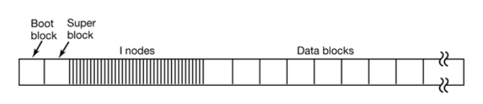
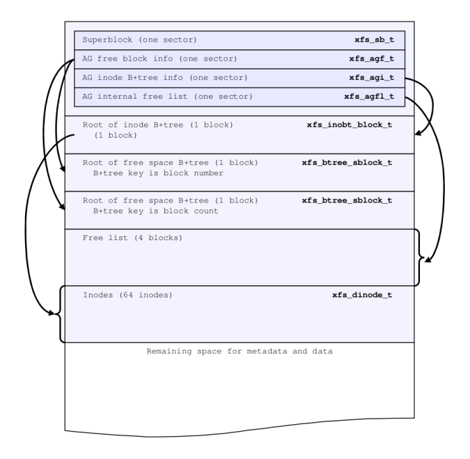
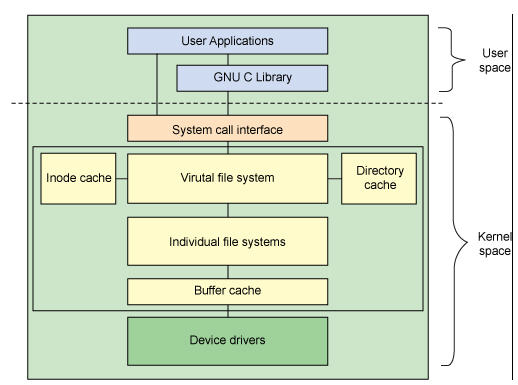
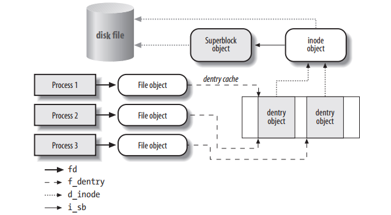
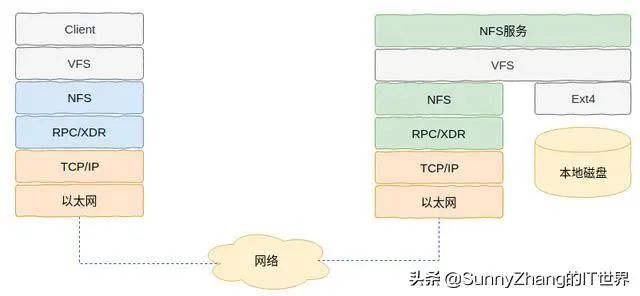
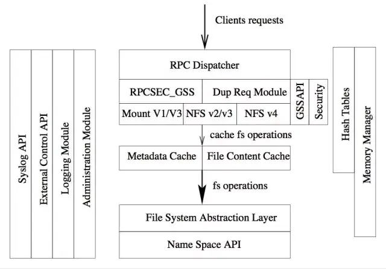
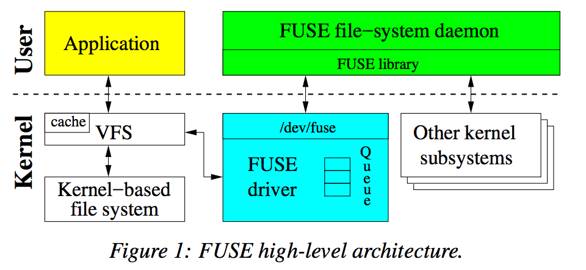

# Linux 文件系统


/// caption
///

## 磁盘与分区

在 Linux 下，对 SCSI 和 SATA 磁盘设备是以 sd 命名的，第一个 scsi 设备是 sda，第二个是 sdb，依此类推。一般主板上有两个SCSI接口，因此一共可以安装四个SCSI设备。主 SCSI 上的两个设备分别对应 sda 和 sdb，第二个 SCSI 口上的两个设备对应 sdc 和 sdd。一般硬盘安装在主 SCSI 的主接口上，所以是 sda 或者 sdb，而光驱一般安装在第二个SCSI的主接口上，所以是 sdc。(IDE接口设备是用 hd 命名的，第一个设备是hda，第二个是hdb，依此类推。NVMe 硬盘命名规则为 nvme[0-9]n[1-9] ，其中 nvme 是固定的前缀，第一个数字表示控制器的编号， n 是固定字符，第二个数字表示该控制器下的命名空间编号。)

<!-- more-->

分区（Partition）是指对一块磁盘子分区的划分，每个分区可以被格式化为不同的文件系统，分区是用设备名称加数字命名的。例如 hda1 代表 hda 这个硬盘设备上的第一个分区。 每个硬盘可以最多有四个主分区，作用是 1-4 命名硬盘的主分区。多个主分区中只能有一个 active 主分区作为启动分区。逻辑分区是从5开始的，每多一个分区，每个磁盘上最多可以有 24个扩展分区。 

分多个区有以下几个目的：

- 在不损失数据的情况下重装系统，比如独立设置 /home 挂载点，重装系统的时候直接标记回 /home，数据不会有任何损失。
- 针对不同的挂载点的特性分配合适的文件系统以合理发挥性能，比如对 /var 使用 reiserfs，对 /home 使用 xfs，对 / 使用 ext4。
- 针对不同的挂载点开启不同的挂载选项，如是否需要即时同步，是否开启日志，是否启用压缩。
- 大硬盘搜索范围大，效率低
- 磁盘配额只能对分区做设定
- /home、/var、/usr/local 经常是单独分区，因为经常会操作，容易产生碎片

可以使用 `fdisk` 命令进行磁盘分区。


完成分区之后，需要对分区进行格式化，所谓格式化就是在该分区之上建立文件系统的过程。之后便可以将格式化之后的文件系统挂载到对应的挂载点下。

可以使用 `mkfs` 命令对分区进行格式化，例如在 /dev/sda1 上创建一个 ext3 文件系统：
```bash
mkfs -t ext3 /dev/sda1
```


Linux 系统启动之后会将[根文件系统](https://cloud.tencent.com/developer/article/1791275)（rootfs）挂载于文件树的根(/)上。当根挂载完成之后，您就可以将其它文件系统挂载于树形结构各种挂载点上。根结构下的任何目录都可以作为挂载点，而您也可以将同一文件系统同时挂载于不同的挂载点上。挂载点实际上就是linux中的磁盘文件系统的入口目录。

可以使用 `mount` 命令将文件系统挂载到某一挂载点下：
```bash
mount /dev/sda1 /test
```

要想使挂载永久生效，需要挂载信息写入 /etc/fstab 文件，系统启动之后会自动读取该文件，并完成文件中的所有挂载。写入格式为：

```bash
设备文件 挂载目录 格式类型 权限选项 是否备份 是否自检
```

例如：
```bash
/dev/sda1               /test                   ext3     defaults        0 0
```

## 本地文件系统

常见的 Linux 本地文件系统包括 ext2,ext3，ext4，xfs，ntfs等，文件系统的任务是将数据和元数据进行组织，使文件在磁盘分区上能进行逻辑读写。一个典型的通过文件系统格式化的磁盘分区如下：


/// caption
///

- **引导块**（Boot block）：为了一致性，每个分区都会从引导块开始，即使引导块不包含操作系统。引导块占据文件系统的前 4096 个字节，从磁盘上的字节偏移量 0 开始。引导块可用于启动操作系统。
- **超级块**（Superblock）：紧跟在引导块后面的是超级块(Superblock)，超级块的大小为 4096 字节，从磁盘上的字节偏移 4096 开始。超级块包含文件系统的所有关键参数
- **空闲空间块管理**：用来管理文件系统的空闲块
- **inode**：inode 保存了存储对象数据的属性和磁盘块位置
- **数据块**：文件内容

对于具体的文件系统，其底层磁盘的 layout 不尽相同，但逻辑上相似，比如 xfs 文件系统在磁盘上的 layout 类似下图：


/// caption
///


为支持不同的文件系统实现，Linux 在具体的文件系统和用户之间建立了一个虚拟文件系统的抽象层（Virtual Filesystem,VFS）。不同的文件系统实现向 VFS 注册自己的实现，用户对文件进行操作时，VFS 根据其文件系统的类型调用不会的操作函数。

/// caption
///

VFS 中有几个关键概念：

- **superblock：** 存储挂载的文件系统的相关信息
- **inode：** 存储一个特定文件的相关信息
- **file：** 存储进程中一个打开的文件的交互相关的信息
- **dentry：** 存储目录和文件的链接信息


/// caption
///

## NFS

[NFS](https://baike.baidu.com/item/%E7%BD%91%E7%BB%9C%E6%96%87%E4%BB%B6%E7%B3%BB%E7%BB%9F/9719420) （Network File System，网络文件系统）最早由 Sun 公司提出。它可以通过网络让不同的主机访问同一个文件系统。

通过 NFS 你可以像访问本地文件系统一样访问 NFS 共享目录。我们通过下面的命令来将一个 NFS 文件系统挂载到本地：
```bash
mount -t nfs <NFS 服务器 IP>:/<共享目录> <挂载点>
```
之后你就可以在挂载点目录下访问 NFS 共享目录了，与访问本地文件系统没有任何差异。


### 协议发展
NFS一共发布了3个版本：NFSv2、NFSv3、NFSv4。其中，NFSv4 包含两个次版本 NFSv4.0 和 NFSv4.1。其中常用的为 v3,v4 。简单的对比如下：

**功能**

- NFSv4.0：是一种有状态的协议，自身实现了文件锁功能和获取文件系统根节点功能。

- NFSv3：对文件锁无感知，同时挂载时可能会覆盖掉v4写入的部分。

**安全性**

- NFSv4.0增加了安全性，支持RPCSEC-GSS身份认证。

**请求**

- NFSv4.0只提供了两个请求NULL和COMPOUND，所有的操作都整合到COMPOUND中，客户端可以根据实际请求将多个操作封装到一个COMPOUND请求中，增加了灵活性。

**命令空间**

- NFSv4.0文件系统的命令空间发生了变化，服务器端必须设置一个根文件系统（fsid=0），其他文件系统挂载在根文件系统上导出。

### Linux 内核 NFS 实现


/// caption
///

从上图所示的整体架构图上可以看出，NFS 也是位于 VFS 下的文件系统。因此当 NFS 挂载后，其与本地文件系统并没有任何差异，用户在使用的时候也是透明的。

内核的 NFS 服务主要包括以下几个组件：

- **nfsd**: 
    - **处理 NFS 客户端的文件操作请求**：nfsd 接收来自客户端的各种 NFS 协议调用，比如读取文件、写入文件、打开目录、查找文件属性、创建或删除文件等，并执行对应的文件系统操作。
    - **实现 NFS 协议逻辑**：它根据 NFS 版本协议（如 NFSv3、NFSv4）的规范，解析客户端发来的请求，并将请求转换成内核的文件系统操作，同时将结果封装成 NFS 响应发送给客户端。
    - **维护文件系统状态**：对于支持状态的 NFS 版本（如 NFSv4），nfsd 还负责维护锁、状态打开的文件句柄等信息。
- **mountd**: 
    - **处理挂载请求**：当 NFS 客户端尝试挂载远程文件系统时，会向服务器上的 mountd 发送挂载请求，mountd 负责验证请求是否合法，以及判断客户端是否有权限访问指定的导出（export）目录。
    - **管理导出目录的访问控制**：mountd 负责根据服务器上的导出配置（通常是 /etc/exports 文件）检查客户端 IP 地址或者主机名是否允许访问某个导出目录。
    - **维护挂载表信息**：它会记录客户端已经挂载的文件系统信息，便于服务器监控当前的挂载状态。
    - **提供给客户端导出目录列表**：客户端可以通过 mountd 查询服务器上可以挂载的文件系统列表。
- **idmapd**: 和 NFSv4 协议一起引入并广泛使用的组件，NFSv1、v2、v3 在设计时没有集成 idmap 功能，这些版本主要处理数字 UID/GID。NFSv4 在 [RFC 3530](https://www.rfc-editor.org/rfc/rfc3530.html) 中正式引入了基于字符串的身份标识（如用户名 @域名格式），为此需要一个用户身份映射服务（idmapd），用来在客户端的字符串身份和服务器的数字 UID/GID 之间做转换。
- **portmapper**: Linux 的 RPC 服务，在客户端请求时，负责响应目的 RPC server 端口返回给客户端，工作在 tcp 与 udp 的 111 端口上
NFS 服务其的端口默认为 2049，

### NFS-Ganesha
NFS-Ganesha 是一个用户态的 NFS 服务器实现。对比 Linux 内核 NFS 实现，用户态的 NFS 服务器实现有以下优势：

- 灵活的内存分配
- 更强的移植性
- 对接 FUSE 文件系统
- 支持更多的分布式文件系统，如 CEPHFS、GlusterFS等

NFS-Ganesha 的整体架构图如下：


/// caption
///

`FSAL` 层将不同的后端存储系统进行抽象与上层协议层对接，可以方便进行扩展，目前 Ganesha 支持如下的 `FSAL`:

- CEPH
- Gluster
- GPFS
- VFS
- XFS
- Luster
- RGW
- KVSFS
- LIZARDFS
- Proxy_V3
- Proxy_V4

参见：[支持的后端存储系统](https://github.com/nfs-ganesha/nfs-ganesha/wiki/Fsalsupport#supported-fsal-backends)

### 其他
#### NFS 权限控制

#### NFS 常用参数


## Fuse
Fuse(filesystem in userspace),是一个用户空间的文件系统。通过 fuse 内核模块的支持，开发者只需要根据 fuse 提供的接口实现具体的文件操作就可以实现一个文件系统。由于其主要实现代码位于用户空间中，而不需要重新编译内核，这给开发者带来了众多便利。


/// caption
///

## 参考
- https://www.cnblogs.com/cxuanBlog/p/12565601.html
- https://www.cnblogs.com/kuangdaoyizhimei/p/18311375
- [Windows/Linux文件系统类型介绍](https://zhuanlan.zhihu.com/p/683346517)
- [xfs](https://mirrors.edge.kernel.org/pub/linux/utils/fs/xfs/docs/xfs_filesystem_structure.pdf)
- [深入理解Linux内核——VFS](https://wushifublog.com/2020/05/22/%E6%B7%B1%E5%85%A5%E7%90%86%E8%A7%A3Linux%E5%86%85%E6%A0%B8%E2%80%94%E2%80%94VFS/)
- [NFS-Ganesha 核心架构解读](https://zhuanlan.zhihu.com/p/34833897)
- [FUSE文件系统](https://www.cnblogs.com/Linux-tech/p/14110335.html)