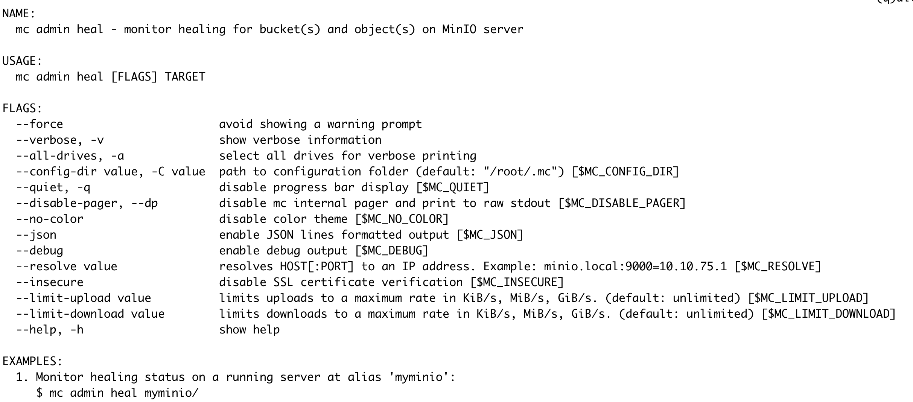

# 【MINIO】数据修复
---

## 概念
Healing是指MINIO恢复已损坏、部分丢失的对象的能力。损坏的类型包括：

- 驱动器故障。
- 文件系统故障。
- bitrot。

MINIO会在以下情况下，触发数据修复流程：

- GET请求期间
  MinIO 会在每次使用 GET 或 HEAD 操作请求对象时，自动检查对象数据分片的一致性。对于受版本控制的存储桶，MinIO 还会在 PUT 操作作期间检查一致性。

  如果发现所有数据分片都完好无损，则 MinIO 将根据数据分片返回对象数据，而不检查相应的奇偶校验分片。

  如果对象的数据分片缺失或损坏，则 MinIO 会使用可用的奇偶校验分片计算对象数据进行返回（同时将数据修复任务加入mrf修复序列中，异步执行Object修复）。每个丢失或损坏的数据分片都必须有一个完整的奇偶校验分片可用，否则无法恢复对象。如果任何奇偶校验分片丢失或损坏，MinIO 将恢复奇偶校验分片，前提是有足够的其他奇偶校验分片来为对象提供服务。

- Scanner扫描期间
  代码存在BUG，导致Scanner子系统永远不会触发数据修复。（data-scan seems always skip heal? · minio/minio · Discussion #21300）

  MinIO 使用对象扫描程序来执行许多与对象相关的任务。其中一项任务会检查对象的完整性，如果发现对象已损坏或损坏，则会修复它们。
  在每次扫描过程中，MinIO 使用对象名称的哈希值与scanner周期数做取模计算，默认每个Object会在每1024轮被选中，执行Heal操作。
  如果发现任何对象丢失了分片，MinIO 会从可用分片中修复该对象。默认情况下，MinIO 不使用扫描程序检查bitrot损坏。这可能是一个比较重的操作，并且跨多个磁盘的bitrot的风险很低。

- 手动触发
  管理员可以使用 mc admin heal 启动完整的系统修复。该程序非常耗费资源，通常不需要。

## 实现
### 核心API及其实现

MINIO的数据恢复能力都是构建在这几个核心的API之上的，有些恢复场景是将这些API集成在框架中，有些是直接调用API。

```go
// ObjectLayer implements primitives for object API layer.
type ObjectLayer interface {
// ...
        // Healing operations.
        HealFormat(ctx context.Context, dryRun bool) (madmin.HealResultItem, error)
        HealBucket(ctx context.Context, bucket string, opts madmin.HealOpts) (madmin.HealResultItem, error)
        HealObject(ctx context.Context, bucket, object, versionID string, opts madmin.HealOpts) (madmin.HealResultItem, error)
        HealObjects(ctx context.Context, bucket, prefix string, opts madmin.HealOpts, fn HealObjectFn) error
        CheckAbandonedParts(ctx context.Context, bucket, object string, opts madmin.HealOpts) error
// ...
}
```

### HealObject
HealObject从Pool层开始调用，并发请求每个Pool，每个Pool内按照hash确定Object所属Set，对应Set执行修复流程，修复主流程如下：

### HealBucket

### 相关数据结构

#### healSequence

一个数据恢复序列，保存数据修复过程中的各种状态及统计指标。本身不处理恢复任务，将恢复任务转发给healRoutine处理。

```go
type healSequence struct {
        // bucket, and object on which heal seq. was initiated
        bucket, object string

        // Report healing progress
        reportProgress bool

        // time at which heal sequence was started
        startTime time.Time

        // time at which heal sequence has ended
        endTime time.Time

        // Heal client info
        clientToken, clientAddress string

        // was this heal sequence force started?
        forceStarted bool

        // heal settings applied to this heal sequence
        settings madmin.HealOpts

        // current accumulated status of the heal sequence
        currentStatus healSequenceStatus

        // channel signaled by background routine when traversal has
        // completed
        traverseAndHealDoneCh chan error

        // canceler to cancel heal sequence.
        cancelCtx context.CancelFunc

        // the last result index sent to client
        lastSentResultIndex int64

        // Number of total items scanned against item type
        scannedItemsMap map[madmin.HealItemType]int64

        // Number of total items healed against item type
        healedItemsMap map[madmin.HealItemType]int64

        // Number of total items where healing failed against item type
        healFailedItemsMap map[madmin.HealItemType]int64

        // The time of the last scan/heal activity
        lastHealActivity time.Time

        // Holds the request-info for logging
        ctx context.Context

        // used to lock this structure as it is concurrently accessed
        mutex sync.RWMutex
}
```

#### allHealState

在内存中保存所有的数据恢复序列状态，以及本地磁盘探测及恢复状态（用于新磁盘的格式化及数据恢复）。

- `healSeqMap`： key为数据恢复作用的路径，同一路径只能存在一个修复修复序列。
- `healLocalDisks`，`healStatus`用于监控本地磁盘的状态，对新磁盘进行格式化和数据恢复。

每个server在内存中保存两个全局的`allHealState`变量：

- `globalBackgroundHealState`:  只有一个bgSeq序列，id:"0000-0000-0000-0000"，用来处理新磁盘格式化等后台自动进行的数据修复任务。

- `globalAllHealState`:  对应Admin API手动触发的修复任务，每次新的Heal请求会在该state中新增seq（不同的Path）。

```go
type allHealState struct {
        sync.RWMutex

        // map of heal path to heal sequence
        healSeqMap map[string]*healSequence // Indexed by endpoint
        // keep track of the healing status of disks in the memory
        //   false: the disk needs to be healed but no healing routine is started
        //    true: the disk is currently healing
        healLocalDisks map[Endpoint]bool 
        healStatus     map[string]healingTracker // Indexed by disk ID
}
```

#### healingTracker

`healingTracker` 用来持久化一次新磁盘格式化和数据恢复过程中的相关信息，对应 .minio.sys/buckets/.healing.bin文件，记录的内容包括：

```go
type healingTracker struct {
        disk StorageAPI    `msg:"-"`
        mu   *sync.RWMutex `msg:"-"`

        ID         string    // Disk ID
        PoolIndex  int       // Pool index
        SetIndex   int       // Set index
        DiskIndex  int       // Disk index
        Path       string    // Path to drive
        Endpoint   string    // Endpoint of drive
        Started    time.Time
        LastUpdate time.Time

        ObjectsTotalCount uint64
        ObjectsTotalSize  uint64

        ItemsHealed uint64
        ItemsFailed uint64

        BytesDone   uint64
        BytesFailed uint64

        // Last object scanned.
        Bucket string `json:"-"`
        Object string `json:"-"`

        // Numbers when current bucket started healing,
        // for resuming with correct numbers.
        ResumeItemsHealed  uint64 `json:"-"`
        ResumeItemsFailed  uint64 `json:"-"`
        ResumeItemsSkipped uint64 `json:"-"`
        ResumeBytesDone    uint64 `json:"-"`
        ResumeBytesFailed  uint64 `json:"-"`
        ResumeBytesSkipped uint64 `json:"-"`

        // Filled on startup/restarts.
        QueuedBuckets []string

        // Filled during heal.
        HealedBuckets []string

        // ID of the current healing operation
        HealID string

        ItemsSkipped uint64
        BytesSkipped uint64

        RetryAttempts uint64

        Finished bool // finished healing, whether with errors or not

        // Add future tracking capabilities
        // Be sure that they are included in toHealingDisk
}
```

#### healRoutine
接受`healtask`，处理数据修复任务，全局一个实例（`globalBackgroundHealRoutine`）多个worker，worker数量默认为GOMAXPROCS/2，可以通过_MINIO_HEAL_WORKERS环境变量指定。

```go
type healRoutine struct {
        tasks   chan healTask
        workers int
}
```

#### healTask

一次heal任务，包括heal作用的对象及相关参数，通过channel传递给healRoutine处理。

```go
// healTask represents what to heal along with options
//
//        path: '/' =>  Heal disk formats along with metadata
//        path: 'bucket/' or '/bucket/' => Heal bucket
//        path: 'bucket/object' => Heal object
type healTask struct {
        bucket    string
        object    string
        versionID string
        opts      madmin.HealOpts
        // Healing response will be sent here
        respCh chan healResult
}
```

#### mrfState

`mrfState`用来保证一个Object的分片完整性，该子系统启动时会监听一个任务队列，由该队列输入修复任务，一个修复任务表示由一次没有完全成功（满足quorum要求）的上传或删除动作，导致的minio节点之间的分片数据不一致，触发修复任务入队的时机为GET请求或在受版本控制的Bucket中的PUT请求。

```go
// 用于表示对象成功上传或删除，但未完全写入所有磁盘的情况，只要满足法定人数即可。
type PartialOperation struct {
        Bucket              string
        Object              string
        VersionID           string
        Versions            []byte
        SetIndex, PoolIndex int
        Queued              time.Time
        BitrotScan          bool
}
```

### Heal 场景
#### 新磁盘格式化及数据恢复
一个erasureSet中的磁盘在启动之后是不可更改的，但可能出现数据盘损坏，需要替换磁盘的场景，在该场景下，需要对新磁盘进行格式化，及对应的数据恢复。

MINIO默认会启动一个定时任务（默认频率为10s一次），该定时任务通过定期获取本地磁盘的修复状态，来保证检测到的新磁盘被修复。磁盘的修复状态存储在一个全局Map中：

> key:  endpoint，存放 PoolIdx, SetIdx, DiskIdx 等信息。
  val：标识是否已经被修复
    - false：未修复，需要执行Heal。
    - true：已修复。

```go
type allHealState struct {
        sync.RWMutex

        // map of heal path to heal sequence
        healSeqMap map[string]*healSequence // Indexed by endpoint
        // keep track of the healing status of disks in the memory
        //   false: the disk needs to be healed but no healing routine is started
        //    true: the disk is currently healing
        healLocalDisks map[Endpoint]bool 
        healStatus     map[string]healingTracker // Indexed by disk ID
}
```

该状态表的更新由另一个定时任务完成。服务启动后，根据启动命令创建对应的erasureSets，在每个erasureSet内部，会开启一个定时任务（默认频率15s一次，需要比上面的任务定时间隔大）去重新连接断开的Endpoint来跟踪它们的状态。

#### 探测新磁盘

定时任务定期获取所有磁盘信息，判断磁盘是否在线，针对掉线的磁盘需要重新建立连接。对于本地磁盘是否在线的判断方法为：读取format.json文件，获取文件中的diskID，判断与内存中的值是否一致，不一致，则证明不在线（可能是发生了磁盘替换，该磁盘上不存在format.json文件）。

在对离线的磁盘进行重新连接的过程中，如果发现为本地磁盘且是一个未被格式化（无format.json文件），需要将该磁盘的状态在全局表中更新。

#### 新磁盘修复

当定时任务获取到新磁盘列表之后，首先会对全部的磁盘执行HealFormat操作，之后并行的去修复新磁盘（同一个erasureSet互斥，不同erasureSet并行）。

修复流程为：
- 获取锁，确保一个erasureSet中的磁盘不会并行修复。
- 获取所有bucket，将bucket修复任务传入globalBackgroundHealState 的seq（"0000-0000-0000-0000"）中，先将所有bucket恢复，此时bucket中的object尚未恢复。
- 并发调用HealObject 恢复各bucket中的object数据。

#### GET/HEAD请求修复 

##### 请求触发修复

对Object进行GET、HEAD请求时，如果Object的数据分片出现损坏、缺失，则会触发MINIO的修复机制；如果数据分片未损坏，校验分片损坏，则不会触发。

MINIO中每个Object的分片分布在object下的xl.meta文件中记录：

```json
{
  "Versions": [
    {
...
      "Metadata": {
        "Type": 1,
        "V2Obj": {
          "CSumAlgo": 1,
          "DDir": "BRBLN//hRVOCokzO0165qg==",
          "EcAlgo": 1,
          "EcBSize": 1048576,
          "EcDist": [
            2,
            3,
            1
          ],
...
        },
        "v": 0
      }
    }
  ]
}
```

在我们使用EC:1的配置下，数据分片有两个，校验分片有一个，如上的[2,3,1]表示：数据分片在第3,1号minio server上，校验分片在minio 2上；即该数组的index表示minio server，index对应的值表示数据分片的序号。

在对Object进行GET请求时，我们请求分片数据的顺序，会按照该分布排序，优先获取数据分片。

```go
// cmd/erasure-decode.go
func (p *parallelReader) Read(dst [][]byte) ([][]byte, error){
// ...
    for i := 0; i < p.dataBlocks; i++ {
            // Setup read triggers for p.dataBlocks number of reads so that it reads in parallel.
            readTriggerCh <- true
    }
// ...
}
```

分片数据的读取是并行的，这里可以看到，先启动与数据分片数量相同的goroutine去获取数据。数据分片读取错误才会继续触发读操作，去获取校验分片的数据。

```go
// cmd/erasure-decode.go
func (p *parallelReader) Read(dst [][]byte) ([][]byte, error){
// ...
        n, err := rr.ReadAt(p.buf[bufIdx], p.offset)
        if err != nil {
                switch {
                case errors.Is(err, errFileNotFound):
                        atomic.StoreInt32(&missingPartsHeal, 1)
                case errors.Is(err, errFileCorrupt):
                        atomic.StoreInt32(&bitrotHeal, 1)
                case errors.Is(err, errDiskNotFound):
                        atomic.AddInt32(&disksNotFound, 1)
                }

                // This will be communicated upstream.
                p.orgReaders[bufIdx] = nil
                if br, ok := p.readers[i].(io.Closer); ok {
                        br.Close()
                }
                p.readers[i] = nil

                // Since ReadAt returned error, trigger another read.
                readTriggerCh <- true
                return
        }
// ...
}
```

读取成功，但是返回错误，证明数据分片有损坏或丢失，会触发分片修复流程，将该操作加入前面提到的globalMRFState任务队列中。

```go
// cmd/erasure-object.go
func (er erasureObjects) getObjectWithFileInfo(ctx context.Context, bucket, object string, startOffset int64, length int64, writer io.Writer, fi FileInfo, metaArr []FileInfo, onlineDisks []StorageAPI) error{
// ...
    written, err := erasure.Decode(ctx, writer, readers, partOffset, partLength, partSize, prefer)
    // Note: we should not be defer'ing the following closeBitrotReaders() call as
    // we are inside a for loop i.e if we use defer, we would accumulate a lot of open files by the time
    // we return from this function.
    closeBitrotReaders(readers)
    if err != nil {
            // If we have successfully written all the content that was asked
            // by the client, but we still see an error - this would mean
            // that we have some parts or data blocks missing or corrupted
            // - attempt a heal to successfully heal them for future calls.
            if written == partLength {
                    if errors.Is(err, errFileNotFound) || errors.Is(err, errFileCorrupt) {
                            healOnce.Do(func() {
                                    globalMRFState.addPartialOp(PartialOperation{
                                            Bucket:     bucket,
                                            Object:     object,
                                            VersionID:  fi.VersionID,
                                            Queued:     time.Now(),
                                            SetIndex:   er.setIndex,
                                            PoolIndex:  er.poolIndex,
                                            BitrotScan: errors.Is(err, errFileCorrupt),
                                    })
                            })
                            // Healing is triggered and we have written
                            // successfully the content to client for
                            // the specific part, we should `nil` this error
                            // and proceed forward, instead of throwing errors.
                            err = nil
                    }
            }
            if err != nil {
                    return toObjectErr(err, bucket, object)
            }
    }
// ...
}
```

#### MRF工作流程

MRF的功能较为明确，即调用Heal核心API，处理分片数据不完整的情况。在服务启动时，MRF会创建一个goroutine，来监听Op channel，将Op channel传入的请求转换为healtask放到bgSeq中交由healRoutine处理。

```go
// healObject sends the given object/version to the background healing workers
func healObject(bucket, object, versionID string, scan madmin.HealScanMode) error {
        // Get background heal sequence to send elements to heal
        bgSeq, ok := globalBackgroundHealState.getHealSequenceByToken(bgHealingUUID)
        if ok {
                return bgSeq.healObject(bucket, object, versionID, scan)
        }
        return nil
}
```

此外，MRF的状态在服务停止时会持久化到磁盘上，对应.minio.sys/buckets/.heal/mrf/list.bin文件，记录尚未完成的PartialOp，在服务启动时会加载该文件，恢复中断的任务。

#### Scanner修复

MINIO中的data-scanner模块主要作用是用来搜集Object相关指标，例如bucket用量、Object数量等。另外，在设计上也用于恢复数据，该恢复的触发是周期性的（1/1024），且不会处理bitrot。

```go
// cmd/data-scanner.go
func (f *folderScanner) scanFolder(ctx context.Context, folder cachedFolder, into *dataUsageEntry) error {
    // ...
    item.heal.enabled = thisHash.modAlt(f.oldCache.Info.NextCycle/folder.objectHealProbDiv, f.healObjectSelect/folder.objectHealProbDiv) && f.shouldHeal()
    item.heal.bitrot = f.scanMode == madmin.HealDeepScan
    // ...
}
```

> 由于shouldHeal()方法存在bug，导致总是返回false，因此目前的版本scan过程中不会触发数据修复。

在enabled被置为true之后，后续扫描到该Object时，会对该Object调用HealObject尝试进行数据恢复。

#### Admin请求手动修复

MINIO提供Admin API，进行手动触发数据恢复。



实现为将Heal请求组织成一个Seq，放入全局的globalAllHealState的healSeqMap中，由后台worker去执行数据恢复任务。
此外，在API Handler内，会对请求heal的Path进行校验，如果当前队列中已经有同名的Seq，则返回当前Seq的状态，不会重复添加任务。
恢复任务的执行

在创建一个Seq之后，会将Seq放入globalAllHealState的全局表中，并同时启动一个后台routine，该routine执行遍历操作，对给定的path进行遍历，获取所有的bucket，将bucket恢复任务交由globalBackgroundHealRoutine处理；同时更新Seq中的修复状态。