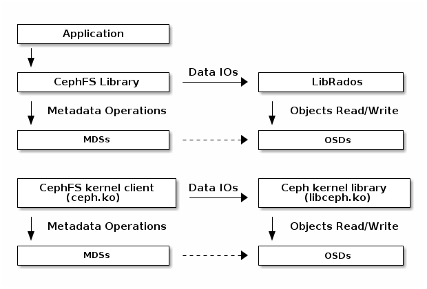

# CEPHFS IO路径

CephFS 中的所有文件数据都存储为 RADOS 对象。CephFS 客户端可以直接访问 RADOS 以作文件数据。
MDS 仅处理元数据作。

要读/写 CephFS 文件，客户端需要具有相应 inode 的 *file read/write* Caps。如果客户端没有
所需的Caps，它会向 MDS 发送“Cap 消息”，告诉 MDS 它想要什么。MDS 会根据情况判断是否可以赋予
客户端对应的Caps。一旦客户端具有 *file read/write* Caps，它就可以直接访问 RADOS 以读/写
文件数据。文件数据以 <inode number>.<object index> 的形式存储为 RADOS 对象。有关更多信息，
请参阅[架构](../../architecture/architecture.md)的“数据条带化”部分。如果文件仅由一个客户
端打开，则 MDS 还会授予唯一的客户端 *file cache/buffer* Cap。“file cache”功能意味着客户
端缓存可以满足文件读取。*file buffer* Cap意味着文件写入可以在客户端缓存中缓冲。

