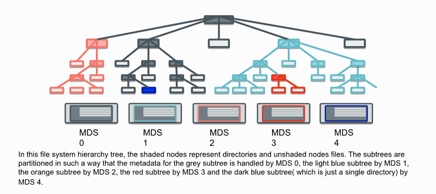

# CEPHFS动态元数据管理

元数据操作通常占所有文件系统操作的50%以上，此外，与扩展存储（反过来又线性扩展 I/O 吞吐量）相比，元数据的扩展方式更加复杂。这是由于文件系统元数据的分层和相互依赖性质。因此，在 CephFS 中，元数据工作负载与数据工作负载分离，以避免给 RADOS 集群带来不必要的压力。元数据由元数据服务器 （MDS）集群处理。CephFS 通过[动态子树分区](https://ceph.com/assets/pdfs/weil-mds-sc04.pdf)在 MDS 之间分发元数据。

## 动态子树分区

在传统的子树分区中，文件系统层次结构的子树被分配给各个 MDS。这种元数据分发策略提供了良好的层次局部性、缓存的线性增长和跨 MDS 的水平扩展，以及跨 MDS 的元数据相当好的分布。

传统子树分区的问题在于，当工作负载按照文件系统层次结构的深度增长时（在单个MDS上），会导致元数据热点问题。这会导致MDS缺乏垂直扩展能力以及浪费非繁忙的MDS资源。

为了解决这个问题，CephFS引入了动态子树分区。在动态子树分区中，将目录树中负载比较密集的部分从压力大的MDS迁移到压力较小的MDS。

这种策略可以确保在出现访问热点目录时MDS的压力得到缓解，使元数据工作负载获得垂直扩展的能力。

## 子树迁移期间的导出过程

Once the exporter verifies that the subtree is permissible to be exported (Non degraded cluster, non-frozen subtree root), the subtree root directory is temporarily auth pinned, the subtree freeze is initiated, and the exporter is committed to the subtree migration, barring an intervening failure of the importer or itself.
一旦导出器验证了允许导出子树（非降级集群、非冻结子树根），子树根目录将被临时身份验证固定，子树冻结将启动，并且导出器将提交到子树迁移，除非导入器或自身发生干预故障。

The MExportDiscover message is exchanged to ensure that the inode for the base directory being exported is open on the destination node. It is auth pinned by the importer to prevent it from being trimmed. This occurs before the exporter completes the freeze of the subtree to ensure that the importer is able to replicate the necessary metadata. When the exporter receives the MDiscoverAck, it allows the freeze to proceed by removing its temporary auth pin.
交换 MExportDiscover 消息以确保要导出的基目录的 inode 在目标节点上处于打开状态。它由导入器进行身份验证固定，以防止其被修剪。这发生在导出器完成子树的冻结之前，以确保导入器能够复制必要的元数据。当导出器收到 MDiscoverAck 时，它允许通过删除其临时身份验证 pin 来继续冻结。

A warning stage occurs only if the base subtree directory is open by nodes other than the importer and exporter. If it is not, then this implies that no metadata within or nested beneath the subtree is replicated by any node other than the importer and exporter. If it is, then an MExportWarning message informs any bystanders that the authority for the region is temporarily ambiguous, and lists both the exporter and importer as authoritative MDS nodes. In particular, bystanders who are trimming items from their cache must send MCacheExpire messages to both the old and new authorities. This is necessary to ensure that the surviving authority reliably receives all expirations even if the importer or exporter fails. While the subtree is frozen (on both the importer and exporter), expirations will not be immediately processed; instead, they will be queued until the region is unfrozen and it can be determined that the node is or is not authoritative.
仅当 base subtree 目录由 importer 和 exporter 以外的节点打开时，才会出现警告阶段。如果不是，则这意味着除导入器和导出器之外的任何节点都不会复制子树中或嵌套在子树下的元数据。如果是，则 MExportWarning 消息会通知任何旁观者该区域的颁发机构暂时不明确，并将导出程序和导入程序列为权威 MDS 节点。特别是，从缓存中修剪项目的旁观者必须向新旧机构发送 MCacheExpire 消息。这是必要的，以确保即使进口商或出口商失败，仍然存在的当局也能可靠地收到所有到期日。当子树被冻结时（在 importer 和 exporter 上），不会立即处理过期;相反，它们将排队，直到区域解冻，并且可以确定该节点是否具有权威性。

The exporter then packages an MExport message containing all metadata of the subtree and flags the objects as non-authoritative. The MExport message sends the actual subtree metadata to the importer. Upon receipt, the importer inserts the data into its cache, marks all objects as authoritative, and logs a copy of all metadata in an EImportStart journal message. Once that has safely flushed, it replies with an MExportAck. The exporter can now log an EExport journal entry, which ultimately specifies that the export was a success. In the presence of failures, it is the existence of the EExport entry only that disambiguates authority during recovery.
然后，导出器打包包含子树的所有元数据的 MExport 消息，并将对象标记为非权威对象。MExport 消息将实际的子树元数据发送到导入器。收到后，导入程序将数据插入其缓存中，将所有对象标记为权威对象，并在 EImportStart 日记消息中记录所有元数据的副本。一旦安全刷新，它就会回复 MExportAck。导出器现在可以记录 EExport 日志条目，该条目最终指定导出成功。在存在故障的情况下，只有 EExport 条目的存在才能在恢复过程中消除权限的歧义。

Once logged, the exporter will send an MExportNotify to any bystanders, informing them that the authority is no longer ambiguous and cache expirations should be sent only to the new authority (the importer). Once these are acknowledged back to the exporter, implicitly flushing the bystander to exporter message streams of any stray expiration notices, the exporter unfreezes the subtree, cleans up its migration-related state, and sends a final MExportFinish to the importer. Upon receipt, the importer logs an EImportFinish(true) (noting locally that the export was indeed a success), unfreezes its subtree, processes any queued cache expirations, and cleans up its state.
记录后，导出器将向任何旁观者发送 MExportNotify，通知他们权限不再模棱两可，缓存过期时间应仅发送给新权限（导入器）。一旦这些被确认回导出器，隐式地将旁观者刷新到导出器消息流中任何杂散的过期通知，导出器就会解冻子树，清理其与迁移相关的状态，并将最终的 MExportFinish 发送到导入器。收到后，导入程序会记录 EImportFinish（true）（在本地注意导出确实成功），解冻其子树，处理任何排队的缓存过期时间，并清理其状态。