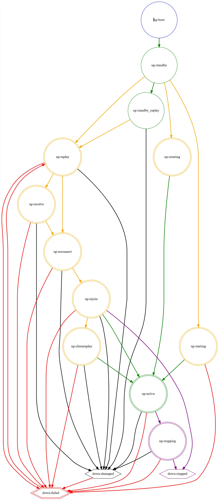

# MDS 状态
元数据服务器 （MDS） 在 CephFS 中的正常工作期间会经历多种状态。例如，某些状态指示 MDS 正在从MDS 的上一个实例的故障转移中恢复。在这里，我们将记录所有这些状态，并包含一个状态图来可视化转换。

## 状态描述
### 常见状态
```
up:active
```

这是MDS的正常运行状态，表示MDS服务及其在文件系统中的rank (1) 可用。
{ .annotate }

1. 每个 CephFS 都有几个 rank ，默认是一个，从 0 起。一个 rank 可看作是一个元数据分片。文件系统 rank 数量的控制在 多活 MDS 守护进程的配置 里详述。

```
up:standby
```
处于该状态的MDS可以接管失败的Rank。Mon会自动将失败的Rank分配给处于该状态的MDS。

```
up:standby_replay
```
处于该状态的MDS正在跟踪另一个处于up:active状态的MDS的日志，如果跟踪的MDS发生故障，则该MDS可以更快的接管服务。同时也存在一定的缺点，即它们不能接管除跟跟踪的MDS意外的故障MDS服务。

### 不太常见的或暂时的状态
```
up:boot
```
此状态在MDS启动期间广播到MON。此状态永远不会可见，因为MON会立即将 MDS 分配给可用Rank或命令 MDS 作为standby队列运行。为了完整起见，此处记录了该状态。

```
up:creating
```
MDS 通过构建一些每个Rank的元数据（如日志）并加入 MDS 集群来创建新的Rank（可能是rank 0）。

```
up:starting
```
MDS 正在重新启动已停止的Rank,它将打开Rank关联的元数据并加入MDS集群。

```
up:stopping
```
当Rank停止时，MON命令活动 MDS 进入 up：stopping 状态。在此状态下，MDS 不接受新的客户端连接，将所有子树迁移到文件系统中的其他Rank，刷新其元数据日志，如果是最后一个Rank （0），则驱逐所有客户端并关闭（另请参阅 CephFS 管理命令）。

```
up:replay
```
MDS 接管失败的Rank。此状态表示 MDS 正在恢复其日志和其他元数据。

```
up:resolve
```
如果 Ceph 文件系统有多个Rank（包括这个Rank），即它不是单活 MDS 集群，则 MDS 会从 up：replay进入此状态。MDS 正在解决任何未提交的 MDS 操作。文件系统中的所有 Rank 都必须处于此状态或更高状态才能进行，即任何 Rank 都不能失败/损坏或 up：replay。

```
up:reconnect
```
MDS 从 up：replay 或 up：resolve 进入此状态。此状态用于请求客户端重新连接。在此期间，任何具有此Rank会话的客户端都必须重新连接，可通过 mds_reconnect_timeout 进行配置。

```
up:rejoin
```
MDS 从 up：reconnect 进入此状态。在此状态下，MDS 正在重新加入 MDS 集群缓存。特别是，元数据上的所有 MDS 间锁都会重新建立。

如果没有要重放的已知客户端请求，则 MDS 会直接从此状态变为 up：active。

```
up:clientreplay
```
MDS 可以从 up：rejoin 进入此状态。MDS 正在重放已回复但尚未持久（未记录）的任何客户端请求。客户端在 up：reconnect 期间重新发送这些请求，并且请求将再次重放。MDS 在完成重放后进入 up：active。

### 失败的状态
```
down:failed
```
没有 MDS 实际上持有此状态。相反，它应用于文件系统中的Rank。例如：
```
$ ceph fs dump
...
max_mds 1
in      0
up      {}
failed  0
...
```

Rank 0 是失败集的一部分，正在等待由备用 MDS 接管。如果此状态持续存在，则表示未找到合适的 MDS守护程序分配给此Rank。这可能是由于备用守护进程不足，或者所有备用守护进程都不兼容的兼容性造成的(另请参阅升级 MDS 集群)。

```
down:damaged
```
没有 MDS 实际上持有此状态。相反，它应用于文件系统中的Rank。例如：
```
$ ceph fs dump
...
max_mds 1
in      0
up      {}
failed
damaged 0
...
```
Rank 0 已损坏（另请参阅 灾难恢复）并放置在损坏的集合中。以 Rank 0 运行的 MDS 发现元数据损坏，无法自动恢复。需要人工干预。

```
down:stopped
```
没有 MDS 实际上持有此状态。相反，它应用于文件系统中的Rank。例如：
```
$ ceph fs dump
...
max_mds 1
in      0
up      {}
failed
damaged
stopped 1
...
```

通过减少 max_mds 来停止某一Rank（另请参阅配置多个活动的 MDS 守护程序）。

## 状态图
此状态图显示了 MDS/rank 的可能状态转换。图例如下：
### 颜色
- 绿色：MDS 处于活动状态。
- 橙色：MDS 处于暂时状态，正在尝试变为活动状态。
- 红色：MDS 处于表示导致Rank标记为失败的状态。
- 紫色：MDS 和Rank正在停止。
- 黑色：MDS 处于表示导致Rank标记为损坏的状态。
### 形状
- 圆圈：MDS 保持此状态。
- 六边形：没有 MDS 保持此状态（它应用于排名）。
### 线
- 双线形状表示排名为 “in”。



