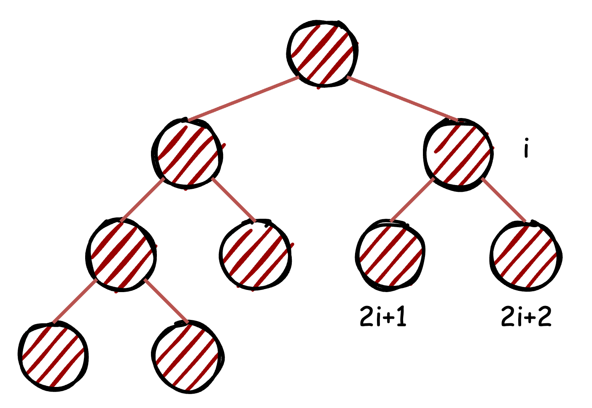
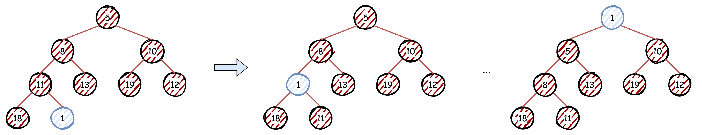
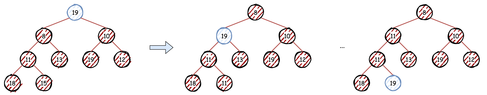

# Heap
`Heap`（堆）是一种特殊的树形数据结构，通常是一个可以被看做一棵完全二叉树的数组对象。它维护一种偏序关系，每个节点的值都大于或等于其子节点的值（大根堆），或小于或等于其子节点的值（小根堆）。`Heap` 维护这种偏序关系的性质，使得堆的根节点是堆中的最大或最小元素。就实现而言，一般其底层容器为数组，也可以是其他容器，有一定的限制，就Go而言，其底层容器需要实现`heap.Interface`的所有接口。

借助Go中的`Heap`简要说明`Heap`的原理及使用。

<!-- more -->

## 基本原理

### 完全二叉树组织
完全二叉树是指除了最后一层外，其他层都是满的，且最后一层的节点都靠左排列。



父子关系，对于节点`i`，其左子节点为`2*i+1`，右子节点为`2*i+2`，父节点为`(i-1)/2`。

### 偏序关系维持
偏序关系维持是指在堆中维护偏序关系的性质。在大根堆中，每个节点的值都大于或等于其子节点的值；在小根堆中，每个节点的值都小于或等于其子节点的值。  
这种偏序关系在完全二叉树上可以通过以下方式维持：

1. 插入节点：将新节点插入到完全二叉树的最后一个位置，然后通过与父节点比较，若不符合偏序关系，则交换位置，直到满足偏序关系。
2. 删除根节点：将最后一个节点替换到根位置，然后通过与子节点比较，若不符合偏序关系，则交换位置，直到满足偏序关系。

## 实现
以Go中的`heap`为例，`heap`要求其底层容器实现以下接口，它们在维持堆的偏序关系时需要使用：

```go
type Interface interface {
	sort.Interface
	Push(x any) // add x as element Len()
	Pop() any   // remove and return element Len() - 1.
}
```

`heap`本身提供如下方法：

- `Init(h Interface)`：初始化堆，将堆中的元素按照偏序关系进行调整，时间复杂度为`O(n)`。
- `Push(h Interface, x any)`：将元素添加到堆中，时间复杂度为`O(logn)`。
- `Pop(h Interface) any`：移除并返回堆中的最小或最大元素，时间复杂度为`O(logn)`。
- `Remove(h Interface, i int) any`：移除堆中指定索引的元素，时间复杂度为`O(logn)`。
- `Fix(h Interface, i int)`：修复堆中指定索引的元素，时间复杂度为`O(logn)`。

`heap`的核心操作为元素的上浮和下沉，以此维护堆的偏序关系。

以元素入堆为例，首先将元素添加至堆底层容器的末尾，然后对不断的执行上浮操作，保证元素处于正确的位置，直到满足偏序关系。

下面详细介绍上浮和下沉操作。

### 上浮

与父节点比较，若不符合偏序关系，则交换位置，直到满足偏序关系。



```go
func up(h Interface, j int) {
	for {
		i := (j - 1) / 2 // parent
		if i == j || !h.Less(j, i) {
			break
		}
		h.Swap(i, j)
		j = i
	}
}
```

### 下沉

与子节点比较，若不符合偏序关系，则交换位置，直到满足偏序关系。



```go
func down(h Interface, i0, n int) bool {
	i := i0
	for {
		j1 := 2*i + 1
		if j1 >= n || j1 < 0 { // j1 < 0 after int overflow
			break
		}
		j := j1 // left child
		if j2 := j1 + 1; j2 < n && h.Less(j2, j1) {
			j = j2 // = 2*i + 2  // right child
		}
		if !h.Less(j, i) {
			break
		}
		h.Swap(i, j)
		i = j
	}
	return i > i0
}
```


