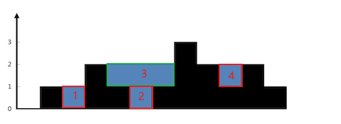

# 42. 接雨水

## 题目

给定 n 个非负整数表示每个宽度为 1 的柱子的高度图，计算按此排列的柱子，下雨之后能接多少雨水。


**示例**


```
输入：height = [0,1,0,2,1,0,1,3,2,1,2,1]
输出：6
解释：上面是由数组 [0,1,0,2,1,0,1,3,2,1,2,1] 表示的高度图，在这种情况下，可以接 6 个单位的雨水（蓝色部分表示雨水）。 
```


<!-- more -->

## 题解

将一个凹槽由整体切分为多层计算，每一层的雨水面积是由左右两个柱子之间的宽度和中间柱子的高度决定的。  
维护一个单调递减栈，遍历柱子数组，当当前柱子的高度高于栈顶元素时，则说明当前元素与栈顶元素以及次顶元素可以形成一个凹槽，计算凹槽的面积并累加到结果中，弹出栈顶元素。循环该过程直至栈为空或者当前元素小于栈顶元素，此时以当前元素为右边界的凹槽面积已经计算完成，将当前元素入栈。



如上图，1号水槽是由0号和2号柱子以及中间的1号柱子组成的，宽度为1，高度为1，面积为1。

## 代码

=== "Go"

    ```go
    func trap(height []int) int {
        stk := make([]int,0)
        ans := 0
        
        for idx,val := range height {
            for len(stk)>0 && val >= height[stk[len(stk) - 1]] {
                bottom := height[stk[len(stk) - 1]]
                stk = stk[:len(stk) - 1]
                if len(stk) > 0 {
                    left := height[stk[len(stk) - 1]]
                    h := min(val,left) - bottom

                    ans += ((idx - stk[len(stk) - 1] - 1)*h)
                }
            } 
            stk = append(stk,idx)
        }
        return ans
    }
    ```