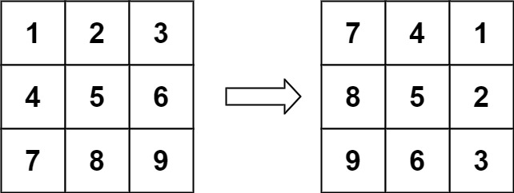

# 48. 旋转图像

## 题目

给定一个  `n × n ` 的二维矩阵  `matrix ` 表示一个图像。请你将图像顺时针旋转 90 度。

你必须在 **原地** 旋转图像，这意味着你需要直接修改输入的二维矩阵。**请不要** 使用另一个矩阵来旋转图像。

**示例1**



> 输入：matrix = [[1,2,3],[4,5,6],[7,8,9]]  
> 输出：[[7,4,1],[8,5,2],[9,6,3]]

**示例2**


> 输入：matrix = [[5,1,9,11],[2,4,8,10],[13,3,6,7],[15,14,12,16]]
> 输出：[[15,13,2,5],[14,3,4,1],[12,6,8,9],[16,7,10,11]]


## 题解

假设旋转前的位置为`(i,j)`,则我们可以得到旋转后的为位置为：`(j,n-1-i)`。要实现如上变换，我们可以将该变换拆分为：

- `(i,j)` -> `(j,i)` => 对角翻转
- `(j,i)` -> `(j, n-1-i)` => 左右翻转

因此，一次旋转等于对角反转加上左右翻转，通过该规律实现原地旋转。


## 代码

=== "Go"

    ```go
    func rotate(matrix [][]int) {
        var m, n = len(matrix), len(matrix[0])
        for i := 0; i < m; i++ {
            for j := 0; j < i; j++ {
                matrix[i][j], matrix[j][i] = matrix[j][i], matrix[i][j]
            }
        }

        for i := 0; i < m; i++ {
            for j := 0; j < n/2; j++ {
                matrix[i][j], matrix[i][n-j-1] = matrix[i][n-j-1], matrix[i][j]
            }
        }
    }
    ```