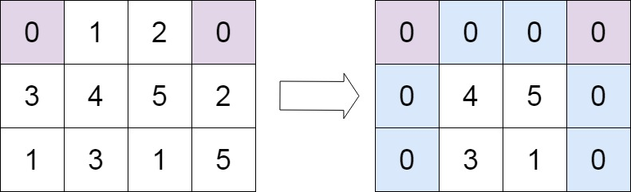

# 73. 矩阵置零

## 题目
给定一个 `m x n` 的矩阵，如果一个元素为 `0` ，则将其所在行和列的所有元素都设为 `0` 。请使用 **原地** 算法。

**示例1**


 
> 输入：matrix = [[1,1,1],[1,0,1],[1,1,1]]  
> 输出：[[1,0,1],[0,0,0],[1,0,1]]

**示例2**



> 输入：matrix = [[0,1,2,0],[3,4,5,2],[1,3,1,5]]  
> 输出：[[0,0,0,0],[0,4,5,0],[0,3,1,0]]


## 题解

一个直观的方法是使用两个数组，分别记录每行、每列是否有0，而后将有0的行列全部置为0，如此空间复杂度为`O(m+n)`。

但注意到，我们可以将该信息直接记录在第一行和第一列上，为避免损失首行首列的原始信息，额外使用两个变量保存首行首列出现的0。如此空间复杂度为`O(1)`


## 代码

=== "Go"

    ```go
    func setZeroes(matrix [][]int) {
        var r, c bool
        var m, n = len(matrix), len(matrix[0])

        for i := 0; i < n; i++ {
            if matrix[0][i] == 0 {
                r = true
            }
        }

        for i := 0; i < m; i++ {
            if matrix[i][0] == 0 {
                c = true
            }
        }

        for i := 1; i < m; i++ {
            for j := 1; j < n; j++ {
                if matrix[i][j] == 0 {
                    matrix[i][0] = 0
                    matrix[0][j] = 0
                }
            }
        }

        for i := 1; i < n; i++ {
            if matrix[0][i] == 0 {
                for j := 0; j < m; j++ {
                    matrix[j][i] = 0
                }
            }
        }

        for i := 1; i < m; i++ {
            if matrix[i][0] == 0 {
                for j := 0; j < n; j++ {
                    matrix[i][j] = 0
                }
            }
        }

        if r {
            for i := 0; i < n; i++ {
                matrix[0][i] = 0
            }
        }
        if c {
            for i := 0; i < m; i++ {
                matrix[i][0] = 0
            }
        }

    }
    ```