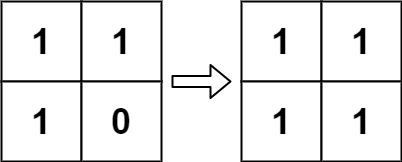

# 289. 生命游戏

## 题目

根据 [百度百科](https://baike.baidu.com/item/%E5%BA%B7%E5%A8%81%E7%94%9F%E5%91%BD%E6%B8%B8%E6%88%8F/22668799?fromtitle=%E7%94%9F%E5%91%BD%E6%B8%B8%E6%88%8F&fromid=2926434) ， **生命游戏** ，简称为 **生命** ，是英国数学家约翰·何顿·康威在 1970 年发明的细胞自动机。

给定一个包含 `m × n` 个格子的面板，每一个格子都可以看成是一个细胞。每个细胞都具有一个初始状态： `1` 即为 活细胞 （live），或 `0` 即为 死细胞 （dead）。每个细胞与其八个相邻位置（水平，垂直，对角线）的细胞都遵循以下四条生存定律：

- 如果活细胞周围八个位置的活细胞数少于两个，则该位置活细胞死亡；
- 如果活细胞周围八个位置有两个或三个活细胞，则该位置活细胞仍然存活；
- 如果活细胞周围八个位置有超过三个活细胞，则该位置活细胞死亡；
- 如果死细胞周围正好有三个活细胞，则该位置死细胞复活；

下一个状态是通过将上述规则同时应用于当前状态下的每个细胞所形成的，其中细胞的出生和死亡是 同时 发生的。给你 `m x n` 网格面板 `board` 的当前状态，返回下一个状态。

给定当前 `board` 的状态，更新 `board` 到下一个状态。

**注意** 你不需要返回任何东西。

**示例 1：**


> 输入：board = [[0,1,0],[0,0,1],[1,1,1],[0,0,0]]  
> 输出：[[0,0,0],[1,0,1],[0,1,1],[0,1,0]]

**示例 2：**



> 输入：board = [[1,1],[1,0]]  
> 输出：[[1,1],[1,1]]  

## 题解

遍历统计即可，为实现原地修改，新增两个状态记录由生到死和由死到生。

## 代码

=== "Go"

    ```go
    const kDie2Alive = 2
    const kAlive2Die = 3

    func gameOfLife(board [][]int) {
        var m, n = len(board), len(board[0])
        for i := 0; i < m; i++ {
            for j := 0; j < n; j++ {
                alive, die := countAround(board, i, j)
                board[i][j] = nextStatus(board[i][j], alive, die)
            }
        }
        for i := 0; i < m; i++ {
            for j := 0; j < n; j++ {
                if board[i][j] == kAlive2Die {
                    board[i][j] = 0
                } else if board[i][j] == kDie2Alive {
                    board[i][j] = 1
                }
            }
        }
    }

    func nextStatus(cur, alive, die int) int {
        if cur == 0 && alive == 3 {
            return kDie2Alive
        }
        if cur == 0 {
            return 0
        }

        if alive < 2 {
            return kAlive2Die
        }

        if alive == 2 || alive == 3 {
            return 1
        }

        if alive > 3 {
            return kAlive2Die
        }
        return -1
    }

    func countAround(board [][]int, i, j int) (alive, die int) {
        around := [][]int{
            {-1, -1},
            {-1, 0},
            {-1, 1},
            {0, 1},
            {1, 1},
            {1, 0},
            {1, -1},
            {0, -1},
        }

        for _, v := range around {
            x := i + v[0]
            y := j + v[1]
            if x >= 0 && x < len(board) && y >= 0 && y < len(board[0]) {
                if board[x][y] == 0 || board[x][y] == 2 {
                    die++
                } else {
                    alive++
                }
            }
        }
        return
    }
    ```